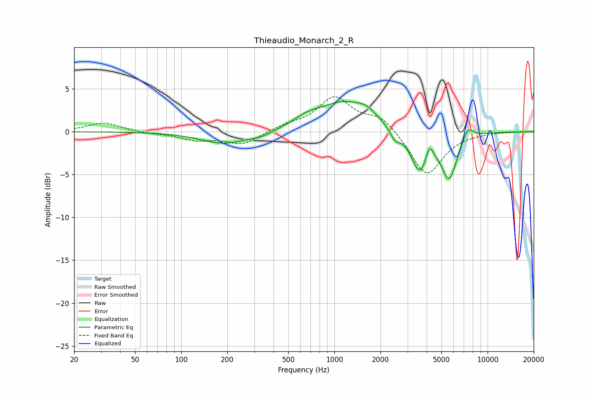

# Thieaudio_Monarch_2_R
See [usage instructions](https://github.com/jaakkopasanen/AutoEq#usage) for more options and info.

### Parametric EQs
Apply preamp of -3.6 dB when using parametric equalizer.

|   # | Type    |   Fc (Hz) |    Q |   Gain (dB) |
|-----|---------|-----------|------|-------------|
|   1 | Peaking |       192 | 0.92 |        -1.4 |
|   2 | Peaking |       334 | 1.9  |        -0.5 |
|   3 | Peaking |       653 | 1.83 |         0.7 |
|   4 | Peaking |      1161 | 0.78 |         3.4 |
|   5 | Peaking |      1626 | 2.48 |         0.7 |
|   6 | Peaking |      2490 | 4.42 |        -1.3 |
|   7 | Peaking |      3600 | 2.45 |        -4.7 |
|   8 | Peaking |      4177 | 6    |         1.8 |
|   9 | Peaking |      5615 | 2.66 |        -5.3 |
|  10 | Peaking |      7433 | 3.8  |         1.5 |

### Fixed Band EQs
When using fixed band (also called graphic) equalizer, apply preamp of **-4.2 dB** (if available) and set gains manually with these parameters.

|   # | Type    |   Fc (Hz) |    Q |   Gain (dB) |
|-----|---------|-----------|------|-------------|
|   1 | Peaking |        31 | 1.41 |         1.1 |
|   2 | Peaking |        62 | 1.41 |        -0.2 |
|   3 | Peaking |       125 | 1.41 |        -0.9 |
|   4 | Peaking |       250 | 1.41 |        -1.5 |
|   5 | Peaking |       500 | 1.41 |         0.6 |
|   6 | Peaking |      1000 | 1.41 |         3.9 |
|   7 | Peaking |      2000 | 1.41 |         1.8 |
|   8 | Peaking |      4000 | 1.41 |        -5.2 |
|   9 | Peaking |      8000 | 1.41 |        -0.1 |
|  10 | Peaking |     16000 | 1.41 |         0   |

### Graphs

