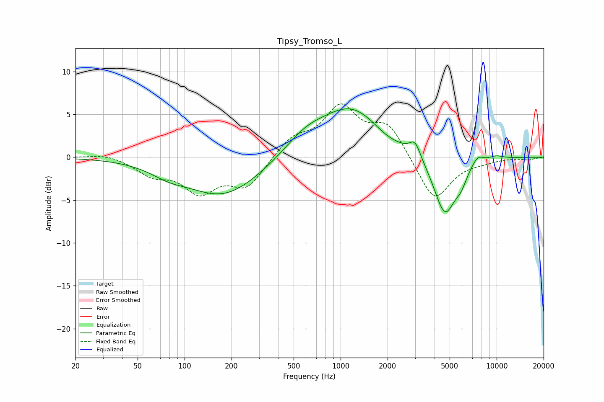

# Tipsy_Tromso_L
See [usage instructions](https://github.com/jaakkopasanen/AutoEq#usage) for more options and info.

### Parametric EQs
Apply preamp of -5.7 dB when using parametric equalizer.

|   # | Type    |   Fc (Hz) |    Q |   Gain (dB) |
|-----|---------|-----------|------|-------------|
|   1 | Peaking |        78 | 1.26 |        -0.9 |
|   2 | Peaking |       178 | 0.59 |        -4.5 |
|   3 | Peaking |       594 | 1.05 |         1.9 |
|   4 | Peaking |      1176 | 0.71 |         5.6 |
|   5 | Peaking |      1962 | 1.65 |        -0.6 |
|   6 | Peaking |      3002 | 4.02 |         1.8 |
|   7 | Peaking |      4670 | 1.9  |        -7   |
|   8 | Peaking |      5928 | 4.07 |        -1.2 |
|   9 | Peaking |      7559 | 3.61 |         1   |
|  10 | Peaking |      9910 | 2.56 |         0.4 |

### Fixed Band EQs
When using fixed band (also called graphic) equalizer, apply preamp of **-6.3 dB** (if available) and set gains manually with these parameters.

|   # | Type    |   Fc (Hz) |    Q |   Gain (dB) |
|-----|---------|-----------|------|-------------|
|   1 | Peaking |        31 | 1.41 |         0.5 |
|   2 | Peaking |        62 | 1.41 |        -1.8 |
|   3 | Peaking |       125 | 1.41 |        -3.7 |
|   4 | Peaking |       250 | 1.41 |        -3.3 |
|   5 | Peaking |       500 | 1.41 |         2.1 |
|   6 | Peaking |      1000 | 1.41 |         5.5 |
|   7 | Peaking |      2000 | 1.41 |         3.7 |
|   8 | Peaking |      4000 | 1.41 |        -5.3 |
|   9 | Peaking |      8000 | 1.41 |        -0.4 |
|  10 | Peaking |     16000 | 1.41 |        -0.3 |

### Graphs

