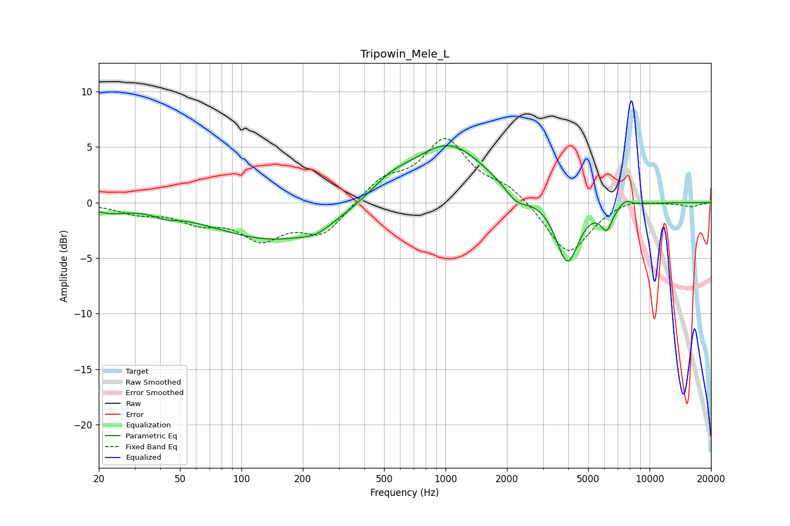

# Tripowin_Mele_L
See [usage instructions](https://github.com/jaakkopasanen/AutoEq#usage) for more options and info.

### Parametric EQs
Apply preamp of -5.2 dB when using parametric equalizer.

|   # | Type    |   Fc (Hz) |    Q |   Gain (dB) |
|-----|---------|-----------|------|-------------|
|   1 | Peaking |        22 | 1.71 |        -0.6 |
|   2 | Peaking |        43 | 2.76 |        -0.4 |
|   3 | Peaking |       149 | 0.46 |        -3.4 |
|   4 | Peaking |       233 | 2.13 |        -0.6 |
|   5 | Peaking |       536 | 1.33 |         1.4 |
|   6 | Peaking |      1038 | 0.77 |         5.3 |
|   7 | Peaking |      2228 | 2.53 |        -1.3 |
|   8 | Peaking |      3957 | 2.51 |        -5.7 |
|   9 | Peaking |      6155 | 4.87 |        -2   |
|  10 | Peaking |      7608 | 4.56 |         0.6 |

### Fixed Band EQs
When using fixed band (also called graphic) equalizer, apply preamp of **-5.9 dB** (if available) and set gains manually with these parameters.

|   # | Type    |   Fc (Hz) |    Q |   Gain (dB) |
|-----|---------|-----------|------|-------------|
|   1 | Peaking |        31 | 1.41 |        -0.8 |
|   2 | Peaking |        62 | 1.41 |        -1.5 |
|   3 | Peaking |       125 | 1.41 |        -2.9 |
|   4 | Peaking |       250 | 1.41 |        -2.8 |
|   5 | Peaking |       500 | 1.41 |         2   |
|   6 | Peaking |      1000 | 1.41 |         5.4 |
|   7 | Peaking |      2000 | 1.41 |         1.3 |
|   8 | Peaking |      4000 | 1.41 |        -4.8 |
|   9 | Peaking |      8000 | 1.41 |         0.5 |
|  10 | Peaking |     16000 | 1.41 |        -0.4 |

### Graphs

