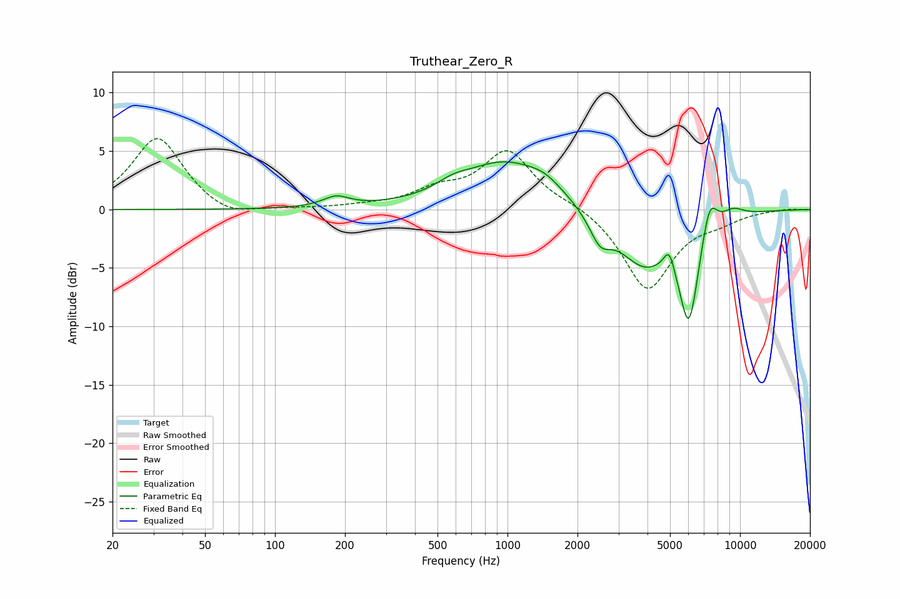

# Truthear_Zero_R
See [usage instructions](https://github.com/jaakkopasanen/AutoEq#usage) for more options and info.

### Parametric EQs
Apply preamp of -4.2 dB when using parametric equalizer.

|   # | Type    |   Fc (Hz) |    Q |   Gain (dB) |
|-----|---------|-----------|------|-------------|
|   1 | Peaking |       183 | 2.47 |         0.9 |
|   2 | Peaking |       581 | 2.07 |         0.6 |
|   3 | Peaking |       973 | 0.75 |         4   |
|   4 | Peaking |      1457 | 1.9  |         0.9 |
|   5 | Peaking |      2501 | 3.07 |        -2.2 |
|   6 | Peaking |      3842 | 1.21 |        -4.5 |
|   7 | Peaking |      4959 | 6    |         1.8 |
|   8 | Peaking |      6030 | 3.16 |        -8.6 |
|   9 | Peaking |      7389 | 4.08 |         3.1 |
|  10 | Peaking |      9331 | 2.71 |         0.8 |

### Fixed Band EQs
When using fixed band (also called graphic) equalizer, apply preamp of **-6.2 dB** (if available) and set gains manually with these parameters.

|   # | Type    |   Fc (Hz) |    Q |   Gain (dB) |
|-----|---------|-----------|------|-------------|
|   1 | Peaking |        31 | 1.41 |         6.2 |
|   2 | Peaking |        62 | 1.41 |        -0.9 |
|   3 | Peaking |       125 | 1.41 |         0   |
|   4 | Peaking |       250 | 1.41 |         0.2 |
|   5 | Peaking |       500 | 1.41 |         1.4 |
|   6 | Peaking |      1000 | 1.41 |         4.9 |
|   7 | Peaking |      2000 | 1.41 |         0.5 |
|   8 | Peaking |      4000 | 1.41 |        -6.9 |
|   9 | Peaking |      8000 | 1.41 |        -0.7 |
|  10 | Peaking |     16000 | 1.41 |         0.1 |

### Graphs

