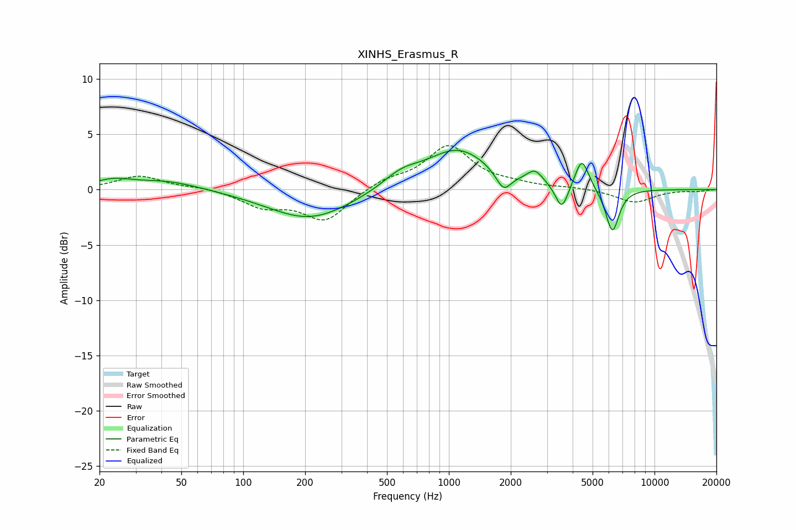

# XINHS_Erasmus_R
See [usage instructions](https://github.com/jaakkopasanen/AutoEq#usage) for more options and info.

### Parametric EQs
Apply preamp of -3.6 dB when using parametric equalizer.

|   # | Type    |   Fc (Hz) |    Q |   Gain (dB) |
|-----|---------|-----------|------|-------------|
|   1 | Peaking |        23 | 1.58 |         0.7 |
|   2 | Peaking |        43 | 0.87 |         0.8 |
|   3 | Peaking |       211 | 0.7  |        -2.7 |
|   4 | Peaking |       587 | 1.55 |         1.2 |
|   5 | Peaking |      1107 | 0.91 |         3.6 |
|   6 | Peaking |      1844 | 3.82 |        -1.7 |
|   7 | Peaking |      2622 | 3.62 |         1.2 |
|   8 | Peaking |      3544 | 4.64 |        -2.3 |
|   9 | Peaking |      4436 | 4.21 |         2.8 |
|  10 | Peaking |      6238 | 4.22 |        -4   |

### Fixed Band EQs
When using fixed band (also called graphic) equalizer, apply preamp of **-4.1 dB** (if available) and set gains manually with these parameters.

|   # | Type    |   Fc (Hz) |    Q |   Gain (dB) |
|-----|---------|-----------|------|-------------|
|   1 | Peaking |        31 | 1.41 |         1.2 |
|   2 | Peaking |        62 | 1.41 |         0.2 |
|   3 | Peaking |       125 | 1.41 |        -1.4 |
|   4 | Peaking |       250 | 1.41 |        -2.8 |
|   5 | Peaking |       500 | 1.41 |         0.8 |
|   6 | Peaking |      1000 | 1.41 |         3.9 |
|   7 | Peaking |      2000 | 1.41 |         0.4 |
|   8 | Peaking |      4000 | 1.41 |         0.2 |
|   9 | Peaking |      8000 | 1.41 |        -1.2 |
|  10 | Peaking |     16000 | 1.41 |        -0.1 |

### Graphs

