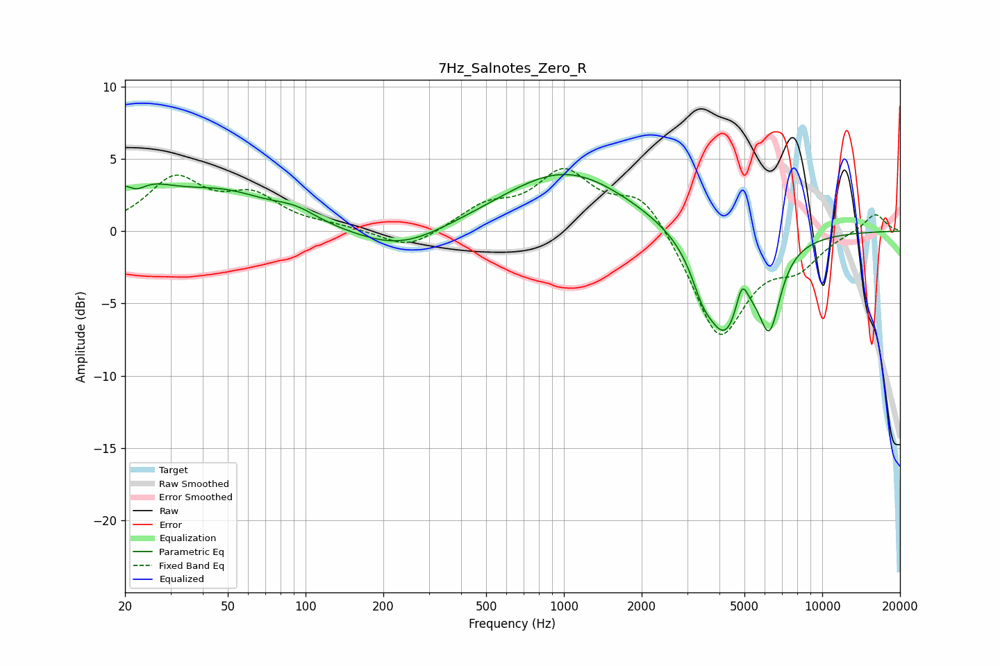

# 7Hz_Salnotes_Zero_R
See [usage instructions](https://github.com/jaakkopasanen/AutoEq#usage) for more options and info.

### Parametric EQs
Apply preamp of -4.0 dB when using parametric equalizer.

|   # | Type    |   Fc (Hz) |    Q |   Gain (dB) |
|-----|---------|-----------|------|-------------|
|   1 | Peaking |        21 | 0.96 |         3   |
|   2 | Peaking |        22 | 4    |        -0.7 |
|   3 | Peaking |        49 | 0.77 |         2.2 |
|   4 | Peaking |        91 | 1.63 |         0.8 |
|   5 | Peaking |       233 | 0.83 |        -1.5 |
|   6 | Peaking |      1016 | 0.57 |         4.2 |
|   7 | Peaking |      3431 | 3.52 |        -1.5 |
|   8 | Peaking |      4208 | 1.7  |        -6.9 |
|   9 | Peaking |      4885 | 6    |         2.1 |
|  10 | Peaking |      6254 | 3.28 |        -5.1 |

### Fixed Band EQs
When using fixed band (also called graphic) equalizer, apply preamp of **-4.4 dB** (if available) and set gains manually with these parameters.

|   # | Type    |   Fc (Hz) |    Q |   Gain (dB) |
|-----|---------|-----------|------|-------------|
|   1 | Peaking |        31 | 1.41 |         3.5 |
|   2 | Peaking |        62 | 1.41 |         2.2 |
|   3 | Peaking |       125 | 1.41 |         0.3 |
|   4 | Peaking |       250 | 1.41 |        -1.3 |
|   5 | Peaking |       500 | 1.41 |         1.5 |
|   6 | Peaking |      1000 | 1.41 |         3.9 |
|   7 | Peaking |      2000 | 1.41 |         2.7 |
|   8 | Peaking |      4000 | 1.41 |        -7.5 |
|   9 | Peaking |      8000 | 1.41 |        -2   |
|  10 | Peaking |     16000 | 1.41 |         1.3 |

### Graphs

