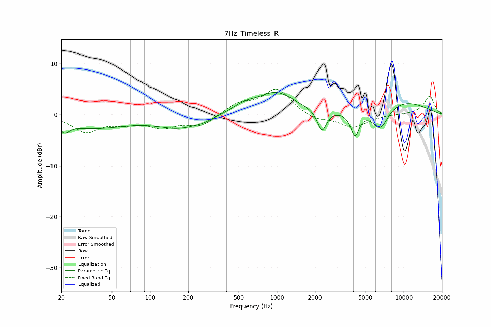

# 7Hz_Timeless_R
See [usage instructions](https://github.com/jaakkopasanen/AutoEq#usage) for more options and info.

### Parametric EQs
Apply preamp of -4.5 dB when using parametric equalizer.

|   # | Type    |   Fc (Hz) |    Q |   Gain (dB) |
|-----|---------|-----------|------|-------------|
|   1 | Peaking |        21 | 3.54 |        -1.7 |
|   2 | Peaking |        36 | 0.53 |        -2.5 |
|   3 | Peaking |       169 | 0.83 |        -2.4 |
|   4 | Peaking |       260 | 2.01 |        -0.5 |
|   5 | Peaking |       545 | 1.6  |         1.3 |
|   6 | Peaking |       984 | 0.95 |         4.2 |
|   7 | Peaking |      2267 | 4.06 |        -4.2 |
|   8 | Peaking |      4134 | 4.07 |        -4.8 |
|   9 | Peaking |      6532 | 2.05 |        -4.7 |
|  10 | Peaking |      9047 | 0.5  |         2.9 |

### Fixed Band EQs
When using fixed band (also called graphic) equalizer, apply preamp of **-5.1 dB** (if available) and set gains manually with these parameters.

|   # | Type    |   Fc (Hz) |    Q |   Gain (dB) |
|-----|---------|-----------|------|-------------|
|   1 | Peaking |        31 | 1.41 |        -3.2 |
|   2 | Peaking |        62 | 1.41 |        -1.3 |
|   3 | Peaking |       125 | 1.41 |        -2.2 |
|   4 | Peaking |       250 | 1.41 |        -2.2 |
|   5 | Peaking |       500 | 1.41 |         2.1 |
|   6 | Peaking |      1000 | 1.41 |         5   |
|   7 | Peaking |      2000 | 1.41 |        -1.1 |
|   8 | Peaking |      4000 | 1.41 |        -2.5 |
|   9 | Peaking |      8000 | 1.41 |         0   |
|  10 | Peaking |     16000 | 1.41 |         3.6 |

### Graphs

