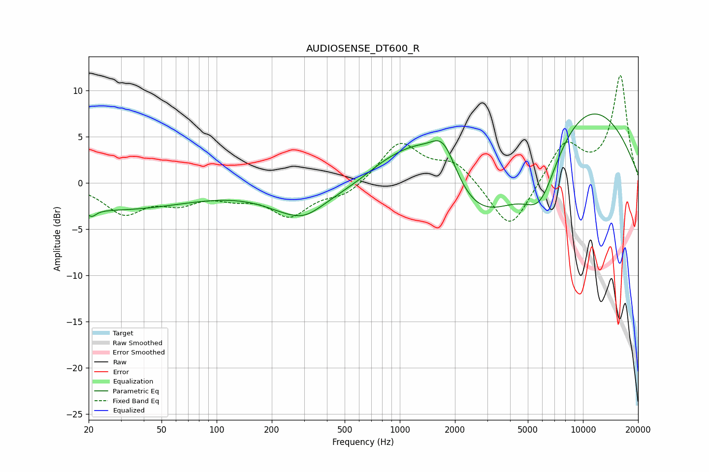

# AUDIOSENSE_DT600_R
See [usage instructions](https://github.com/jaakkopasanen/AutoEq#usage) for more options and info.

### Parametric EQs
Apply preamp of -7.6 dB when using parametric equalizer.

|   # | Type    |   Fc (Hz) |    Q |   Gain (dB) |
|-----|---------|-----------|------|-------------|
|   1 | Peaking |        21 | 5.68 |        -0.8 |
|   2 | Peaking |        25 | 0.3  |        -2.8 |
|   3 | Peaking |       280 | 0.83 |        -3.1 |
|   4 | Peaking |       307 | 1.97 |        -0.4 |
|   5 | Peaking |       827 | 1.05 |         1.7 |
|   6 | Peaking |      1218 | 0.99 |         4.6 |
|   7 | Peaking |      1732 | 1.73 |         5.6 |
|   8 | Peaking |      2779 | 0.47 |        -7.8 |
|   9 | Peaking |      5861 | 1.43 |        -5.7 |
|  10 | Peaking |      9372 | 0.36 |         9.8 |

### Fixed Band EQs
When using fixed band (also called graphic) equalizer, apply preamp of **-11.7 dB** (if available) and set gains manually with these parameters.

|   # | Type    |   Fc (Hz) |    Q |   Gain (dB) |
|-----|---------|-----------|------|-------------|
|   1 | Peaking |        31 | 1.41 |        -3.1 |
|   2 | Peaking |        62 | 1.41 |        -1.8 |
|   3 | Peaking |       125 | 1.41 |        -1.1 |
|   4 | Peaking |       250 | 1.41 |        -3.3 |
|   5 | Peaking |       500 | 1.41 |        -1.3 |
|   6 | Peaking |      1000 | 1.41 |         4.4 |
|   7 | Peaking |      2000 | 1.41 |         2.2 |
|   8 | Peaking |      4000 | 1.41 |        -5.4 |
|   9 | Peaking |      8000 | 1.41 |         4.4 |
|  10 | Peaking |     16000 | 1.41 |        11.5 |

### Graphs

