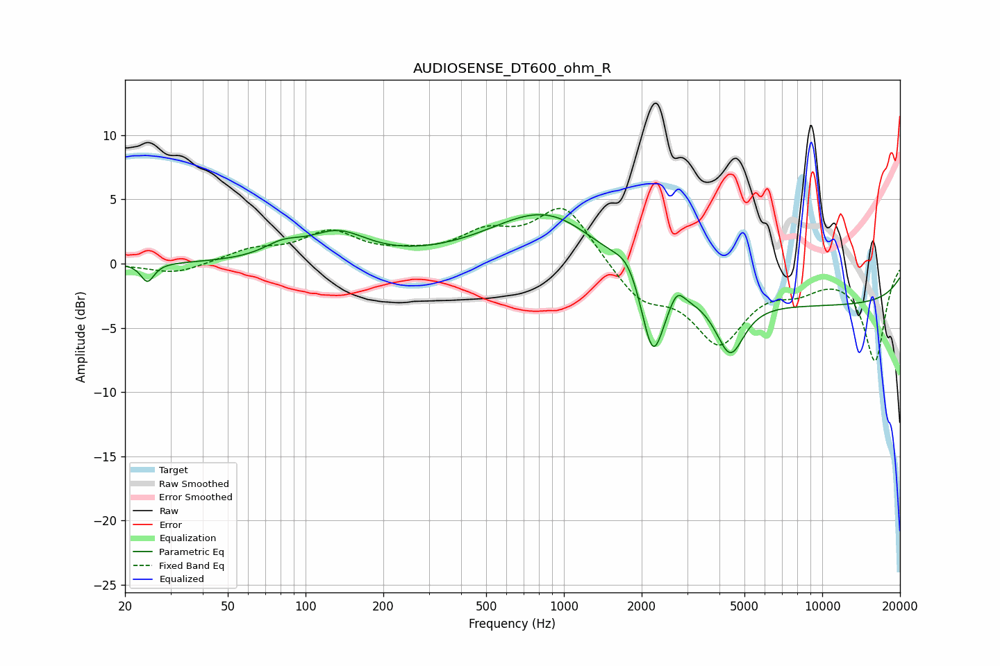

# AUDIOSENSE_DT600_ohm_R
See [usage instructions](https://github.com/jaakkopasanen/AutoEq#usage) for more options and info.

### Parametric EQs
Apply preamp of -3.9 dB when using parametric equalizer.

|   # | Type    |   Fc (Hz) |    Q |   Gain (dB) |
|-----|---------|-----------|------|-------------|
|   1 | Peaking |        24 | 5.71 |        -1.5 |
|   2 | Peaking |        81 | 1.94 |         1   |
|   3 | Peaking |       133 | 1.24 |         2.2 |
|   4 | Peaking |       834 | 0.67 |         4.1 |
|   5 | Peaking |       961 | 1.42 |         0.2 |
|   6 | Peaking |      1767 | 3.02 |         1.3 |
|   7 | Peaking |      2211 | 3.21 |        -6.4 |
|   8 | Peaking |      2736 | 5.16 |         1.2 |
|   9 | Peaking |      4400 | 2.56 |        -4.4 |
|  10 | Peaking |     10000 | 0.18 |        -3.2 |

### Fixed Band EQs
When using fixed band (also called graphic) equalizer, apply preamp of **-4.4 dB** (if available) and set gains manually with these parameters.

|   # | Type    |   Fc (Hz) |    Q |   Gain (dB) |
|-----|---------|-----------|------|-------------|
|   1 | Peaking |        31 | 1.41 |        -0.8 |
|   2 | Peaking |        62 | 1.41 |         1   |
|   3 | Peaking |       125 | 1.41 |         2.3 |
|   4 | Peaking |       250 | 1.41 |         0.5 |
|   5 | Peaking |       500 | 1.41 |         2   |
|   6 | Peaking |      1000 | 1.41 |         4.5 |
|   7 | Peaking |      2000 | 1.41 |        -2.7 |
|   8 | Peaking |      4000 | 1.41 |        -5.8 |
|   9 | Peaking |      8000 | 1.41 |        -1.4 |
|  10 | Peaking |     16000 | 1.41 |        -7.5 |

### Graphs

