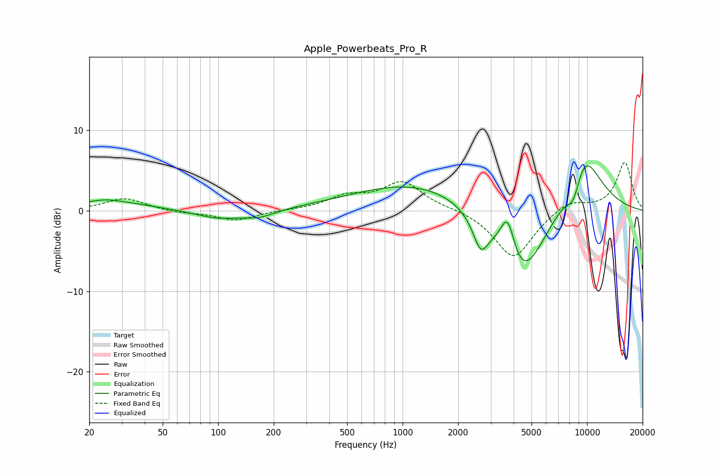

# Apple_Powerbeats_Pro_R
See [usage instructions](https://github.com/jaakkopasanen/AutoEq#usage) for more options and info.

### Parametric EQs
Apply preamp of -5.7 dB when using parametric equalizer.

|   # | Type    |   Fc (Hz) |    Q |   Gain (dB) |
|-----|---------|-----------|------|-------------|
|   1 | Peaking |        24 | 2.58 |         0.2 |
|   2 | Peaking |        26 | 0.74 |         1.2 |
|   3 | Peaking |        99 | 1.2  |        -1   |
|   4 | Peaking |       166 | 1.56 |        -0.9 |
|   5 | Peaking |      2573 | 0.24 |         5.7 |
|   6 | Peaking |      2649 | 3.53 |        -3.7 |
|   7 | Peaking |      3713 | 3.35 |         5.8 |
|   8 | Peaking |      4340 | 0.81 |       -14.4 |
|   9 | Peaking |      8480 | 2.8  |        -4.3 |
|  10 | Peaking |      9349 | 1.26 |         8.7 |

### Fixed Band EQs
When using fixed band (also called graphic) equalizer, apply preamp of **-6.1 dB** (if available) and set gains manually with these parameters.

|   # | Type    |   Fc (Hz) |    Q |   Gain (dB) |
|-----|---------|-----------|------|-------------|
|   1 | Peaking |        31 | 1.41 |         1.6 |
|   2 | Peaking |        62 | 1.41 |        -0.3 |
|   3 | Peaking |       125 | 1.41 |        -1.2 |
|   4 | Peaking |       250 | 1.41 |         0   |
|   5 | Peaking |       500 | 1.41 |         1.6 |
|   6 | Peaking |      1000 | 1.41 |         3.5 |
|   7 | Peaking |      2000 | 1.41 |         0.2 |
|   8 | Peaking |      4000 | 1.41 |        -6   |
|   9 | Peaking |      8000 | 1.41 |         1.4 |
|  10 | Peaking |     16000 | 1.41 |         6   |

### Graphs

