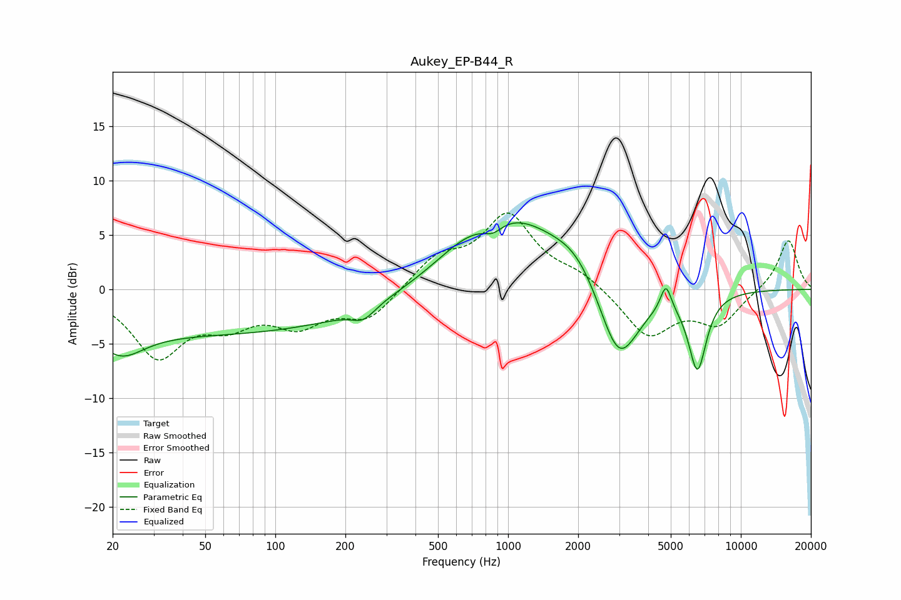

# Aukey_EP-B44_R
See [usage instructions](https://github.com/jaakkopasanen/AutoEq#usage) for more options and info.

### Parametric EQs
Apply preamp of -6.2 dB when using parametric equalizer.

|   # | Type    |   Fc (Hz) |    Q |   Gain (dB) |
|-----|---------|-----------|------|-------------|
|   1 | Peaking |        22 | 1.45 |        -2.6 |
|   2 | Peaking |        54 | 0.18 |        -4   |
|   3 | Peaking |       239 | 2.83 |        -1.2 |
|   4 | Peaking |       625 | 1.15 |         1.1 |
|   5 | Peaking |       862 | 3.44 |        -1   |
|   6 | Peaking |      1049 | 0.63 |         6.4 |
|   7 | Peaking |      1982 | 1.39 |         2.1 |
|   8 | Peaking |      2989 | 1.58 |        -7.9 |
|   9 | Peaking |      4765 | 6    |         2.5 |
|  10 | Peaking |      6510 | 3.48 |        -7.1 |

### Fixed Band EQs
When using fixed band (also called graphic) equalizer, apply preamp of **-7.1 dB** (if available) and set gains manually with these parameters.

|   # | Type    |   Fc (Hz) |    Q |   Gain (dB) |
|-----|---------|-----------|------|-------------|
|   1 | Peaking |        31 | 1.41 |        -5.9 |
|   2 | Peaking |        62 | 1.41 |        -2.5 |
|   3 | Peaking |       125 | 1.41 |        -2.9 |
|   4 | Peaking |       250 | 1.41 |        -2.7 |
|   5 | Peaking |       500 | 1.41 |         2.7 |
|   6 | Peaking |      1000 | 1.41 |         6.6 |
|   7 | Peaking |      2000 | 1.41 |         1.2 |
|   8 | Peaking |      4000 | 1.41 |        -4.3 |
|   9 | Peaking |      8000 | 1.41 |        -3.1 |
|  10 | Peaking |     16000 | 1.41 |         4.7 |

### Graphs

