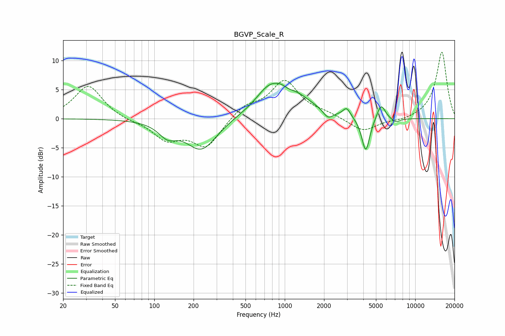

# BGVP_Scale_R
See [usage instructions](https://github.com/jaakkopasanen/AutoEq#usage) for more options and info.

### Parametric EQs
Apply preamp of -6.2 dB when using parametric equalizer.

|   # | Type    |   Fc (Hz) |    Q |   Gain (dB) |
|-----|---------|-----------|------|-------------|
|   1 | Peaking |       126 | 2.11 |        -2.2 |
|   2 | Peaking |       230 | 1.2  |        -5.5 |
|   3 | Peaking |       730 | 1.76 |         1.5 |
|   4 | Peaking |       975 | 0.89 |         6   |
|   5 | Peaking |      1068 | 2.98 |        -0.9 |
|   6 | Peaking |      2145 | 3.83 |        -1.4 |
|   7 | Peaking |      2981 | 5.09 |         1.5 |
|   8 | Peaking |      4177 | 4.53 |        -6.1 |
|   9 | Peaking |      5474 | 4.29 |         2.7 |
|  10 | Peaking |      7062 | 3.78 |        -0.8 |

### Fixed Band EQs
When using fixed band (also called graphic) equalizer, apply preamp of **-11.5 dB** (if available) and set gains manually with these parameters.

|   # | Type    |   Fc (Hz) |    Q |   Gain (dB) |
|-----|---------|-----------|------|-------------|
|   1 | Peaking |        31 | 1.41 |         5.8 |
|   2 | Peaking |        62 | 1.41 |        -0.4 |
|   3 | Peaking |       125 | 1.41 |        -3.4 |
|   4 | Peaking |       250 | 1.41 |        -4.8 |
|   5 | Peaking |       500 | 1.41 |         2.1 |
|   6 | Peaking |      1000 | 1.41 |         6.4 |
|   7 | Peaking |      2000 | 1.41 |         0.7 |
|   8 | Peaking |      4000 | 1.41 |        -2.3 |
|   9 | Peaking |      8000 | 1.41 |        -0.4 |
|  10 | Peaking |     16000 | 1.41 |        11.6 |

### Graphs

