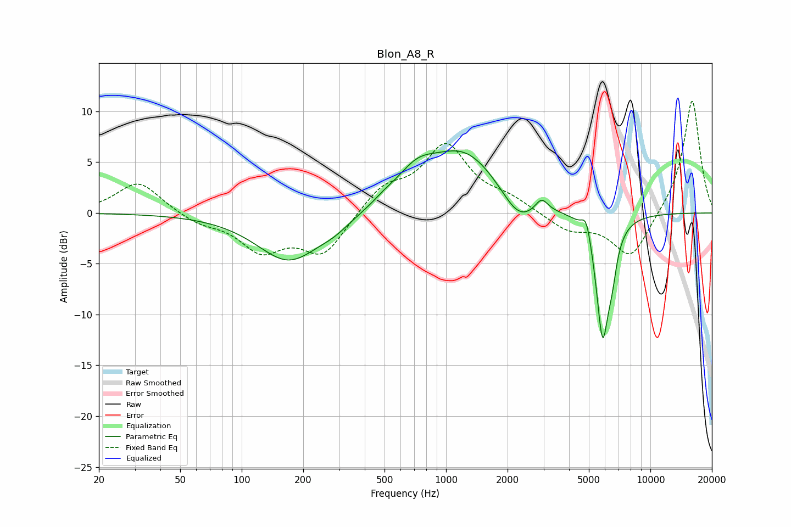

# Blon_A8_R
See [usage instructions](https://github.com/jaakkopasanen/AutoEq#usage) for more options and info.

### Parametric EQs
Apply preamp of -6.2 dB when using parametric equalizer.

|   # | Type    |   Fc (Hz) |    Q |   Gain (dB) |
|-----|---------|-----------|------|-------------|
|   1 | Peaking |       171 | 0.9  |        -4.8 |
|   2 | Peaking |       286 | 1.93 |        -0.7 |
|   3 | Peaking |       500 | 2.46 |         0.4 |
|   4 | Peaking |       715 | 1.46 |         2.5 |
|   5 | Peaking |      1232 | 0.79 |         5.9 |
|   6 | Peaking |      2262 | 1.7  |        -2.7 |
|   7 | Peaking |      2934 | 4.67 |         1.3 |
|   8 | Peaking |      4860 | 6    |         2.1 |
|   9 | Peaking |      5836 | 4.2  |       -12.1 |
|  10 | Peaking |      6491 | 6    |        -2.5 |

### Fixed Band EQs
When using fixed band (also called graphic) equalizer, apply preamp of **-11.1 dB** (if available) and set gains manually with these parameters.

|   # | Type    |   Fc (Hz) |    Q |   Gain (dB) |
|-----|---------|-----------|------|-------------|
|   1 | Peaking |        31 | 1.41 |         3.1 |
|   2 | Peaking |        62 | 1.41 |        -0.9 |
|   3 | Peaking |       125 | 1.41 |        -3.5 |
|   4 | Peaking |       250 | 1.41 |        -4   |
|   5 | Peaking |       500 | 1.41 |         2.4 |
|   6 | Peaking |      1000 | 1.41 |         6.4 |
|   7 | Peaking |      2000 | 1.41 |         1.1 |
|   8 | Peaking |      4000 | 1.41 |        -1.7 |
|   9 | Peaking |      8000 | 1.41 |        -4.5 |
|  10 | Peaking |     16000 | 1.41 |        11.3 |

### Graphs

