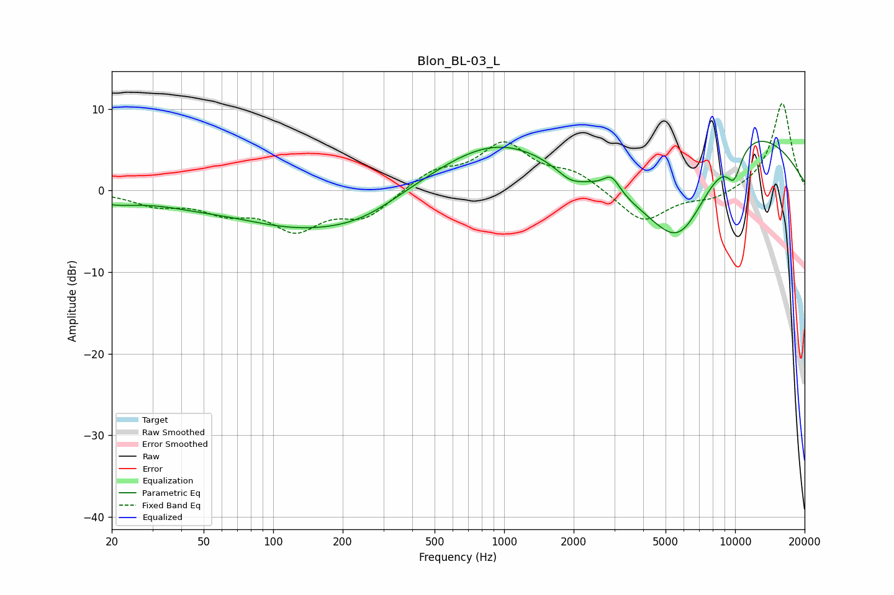

# Blon_BL-03_L
See [usage instructions](https://github.com/jaakkopasanen/AutoEq#usage) for more options and info.

### Parametric EQs
Apply preamp of -6.1 dB when using parametric equalizer.

|   # | Type    |   Fc (Hz) |    Q |   Gain (dB) |
|-----|---------|-----------|------|-------------|
|   1 | Peaking |        20 | 1.22 |        -1.1 |
|   2 | Peaking |        44 | 0.98 |        -0.6 |
|   3 | Peaking |       141 | 0.44 |        -4.5 |
|   4 | Peaking |       248 | 0.94 |        -1.1 |
|   5 | Peaking |       939 | 0.51 |         6.2 |
|   6 | Peaking |      1937 | 2.36 |        -1.4 |
|   7 | Peaking |      2919 | 3.86 |         2   |
|   8 | Peaking |      5741 | 0.73 |       -14.4 |
|   9 | Peaking |      9504 | 0.39 |        11.6 |
|  10 | Peaking |      9902 | 3.7  |        -3.6 |

### Fixed Band EQs
When using fixed band (also called graphic) equalizer, apply preamp of **-10.8 dB** (if available) and set gains manually with these parameters.

|   # | Type    |   Fc (Hz) |    Q |   Gain (dB) |
|-----|---------|-----------|------|-------------|
|   1 | Peaking |        31 | 1.41 |        -1.6 |
|   2 | Peaking |        62 | 1.41 |        -2.2 |
|   3 | Peaking |       125 | 1.41 |        -4.3 |
|   4 | Peaking |       250 | 1.41 |        -3.1 |
|   5 | Peaking |       500 | 1.41 |         2.2 |
|   6 | Peaking |      1000 | 1.41 |         5.5 |
|   7 | Peaking |      2000 | 1.41 |         2   |
|   8 | Peaking |      4000 | 1.41 |        -4   |
|   9 | Peaking |      8000 | 1.41 |        -1.1 |
|  10 | Peaking |     16000 | 1.41 |        10.8 |

### Graphs

