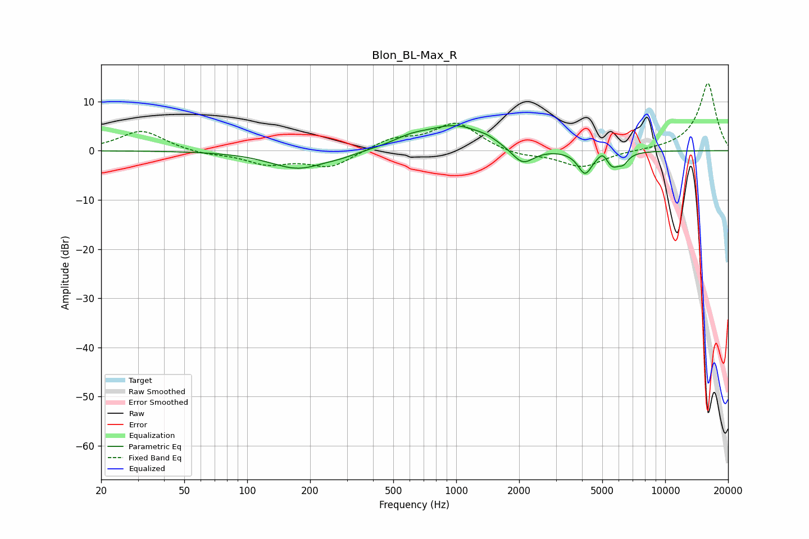

# Blon_BL-Max_R
See [usage instructions](https://github.com/jaakkopasanen/AutoEq#usage) for more options and info.

### Parametric EQs
Apply preamp of -5.2 dB when using parametric equalizer.

|   # | Type    |   Fc (Hz) |    Q |   Gain (dB) |
|-----|---------|-----------|------|-------------|
|   1 | Peaking |       175 | 1.06 |        -3.7 |
|   2 | Peaking |       283 | 2.05 |        -0.5 |
|   3 | Peaking |       602 | 1.64 |         1.4 |
|   4 | Peaking |       998 | 0.97 |         5   |
|   5 | Peaking |      1405 | 3.35 |         0.5 |
|   6 | Peaking |      2080 | 2.62 |        -3.6 |
|   7 | Peaking |      4134 | 4.16 |        -4.5 |
|   8 | Peaking |      5032 | 5.98 |         1.7 |
|   9 | Peaking |      5588 | 3.91 |        -3   |
|  10 | Peaking |      6317 | 6    |        -1.6 |

### Fixed Band EQs
When using fixed band (also called graphic) equalizer, apply preamp of **-13.8 dB** (if available) and set gains manually with these parameters.

|   # | Type    |   Fc (Hz) |    Q |   Gain (dB) |
|-----|---------|-----------|------|-------------|
|   1 | Peaking |        31 | 1.41 |         4.1 |
|   2 | Peaking |        62 | 1.41 |        -0.7 |
|   3 | Peaking |       125 | 1.41 |        -2.5 |
|   4 | Peaking |       250 | 1.41 |        -3.3 |
|   5 | Peaking |       500 | 1.41 |         2.3 |
|   6 | Peaking |      1000 | 1.41 |         5.6 |
|   7 | Peaking |      2000 | 1.41 |        -1.1 |
|   8 | Peaking |      4000 | 1.41 |        -3.4 |
|   9 | Peaking |      8000 | 1.41 |         0   |
|  10 | Peaking |     16000 | 1.41 |        13.8 |

### Graphs

