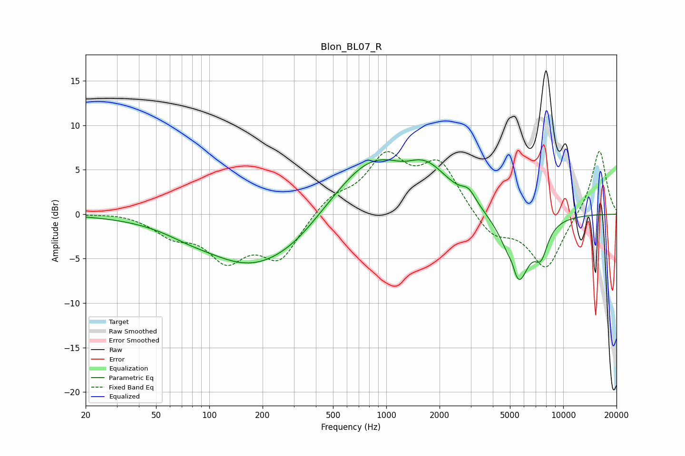

# Blon_BL07_R
See [usage instructions](https://github.com/jaakkopasanen/AutoEq#usage) for more options and info.

### Parametric EQs
Apply preamp of -6.2 dB when using parametric equalizer.

|   # | Type    |   Fc (Hz) |    Q |   Gain (dB) |
|-----|---------|-----------|------|-------------|
|   1 | Peaking |        75 | 1.19 |        -0.4 |
|   2 | Peaking |       181 | 0.49 |        -6   |
|   3 | Peaking |       311 | 1.15 |        -0.5 |
|   4 | Peaking |       811 | 0.63 |         6.3 |
|   5 | Peaking |      1261 | 2.08 |        -0.6 |
|   6 | Peaking |      1693 | 1.08 |         3.5 |
|   7 | Peaking |      2923 | 3.54 |         1.3 |
|   8 | Peaking |      5153 | 6    |         1.2 |
|   9 | Peaking |      5517 | 2.12 |        -8   |
|  10 | Peaking |      7492 | 3.47 |        -3.1 |

### Fixed Band EQs
When using fixed band (also called graphic) equalizer, apply preamp of **-7.2 dB** (if available) and set gains manually with these parameters.

|   # | Type    |   Fc (Hz) |    Q |   Gain (dB) |
|-----|---------|-----------|------|-------------|
|   1 | Peaking |        31 | 1.41 |         0.2 |
|   2 | Peaking |        62 | 1.41 |        -2.1 |
|   3 | Peaking |       125 | 1.41 |        -4.6 |
|   4 | Peaking |       250 | 1.41 |        -4.8 |
|   5 | Peaking |       500 | 1.41 |         1.9 |
|   6 | Peaking |      1000 | 1.41 |         6   |
|   7 | Peaking |      2000 | 1.41 |         5.5 |
|   8 | Peaking |      4000 | 1.41 |        -2.6 |
|   9 | Peaking |      8000 | 1.41 |        -6.2 |
|  10 | Peaking |     16000 | 1.41 |         7.4 |

### Graphs

