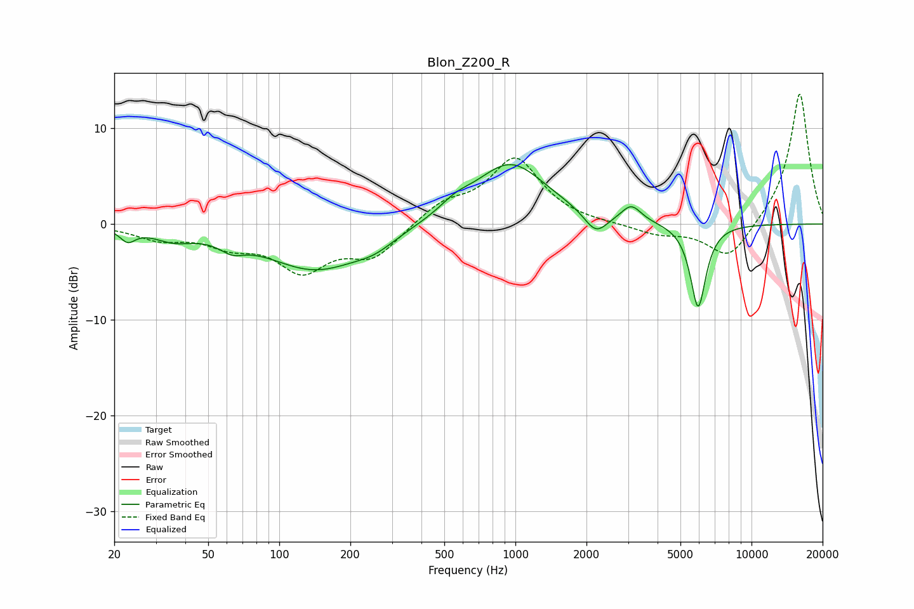

# Blon_Z200_R
See [usage instructions](https://github.com/jaakkopasanen/AutoEq#usage) for more options and info.

### Parametric EQs
Apply preamp of -6.3 dB when using parametric equalizer.

|   # | Type    |   Fc (Hz) |    Q |   Gain (dB) |
|-----|---------|-----------|------|-------------|
|   1 | Peaking |        23 | 4.5  |        -1.3 |
|   2 | Peaking |        36 | 1.67 |        -1.2 |
|   3 | Peaking |        63 | 2.69 |        -1.1 |
|   4 | Peaking |       142 | 0.68 |        -4.7 |
|   5 | Peaking |       254 | 1.65 |        -1   |
|   6 | Peaking |       557 | 2.2  |         1   |
|   7 | Peaking |       951 | 0.91 |         6.4 |
|   8 | Peaking |      2192 | 2.84 |        -2.3 |
|   9 | Peaking |      3096 | 3.39 |         1.7 |
|  10 | Peaking |      5941 | 4.18 |        -8.8 |

### Fixed Band EQs
When using fixed band (also called graphic) equalizer, apply preamp of **-13.7 dB** (if available) and set gains manually with these parameters.

|   # | Type    |   Fc (Hz) |    Q |   Gain (dB) |
|-----|---------|-----------|------|-------------|
|   1 | Peaking |        31 | 1.41 |        -1.4 |
|   2 | Peaking |        62 | 1.41 |        -1.8 |
|   3 | Peaking |       125 | 1.41 |        -4.5 |
|   4 | Peaking |       250 | 1.41 |        -3.2 |
|   5 | Peaking |       500 | 1.41 |         2   |
|   6 | Peaking |      1000 | 1.41 |         6.7 |
|   7 | Peaking |      2000 | 1.41 |        -0   |
|   8 | Peaking |      4000 | 1.41 |        -1   |
|   9 | Peaking |      8000 | 1.41 |        -3.9 |
|  10 | Peaking |     16000 | 1.41 |        13.9 |

### Graphs

