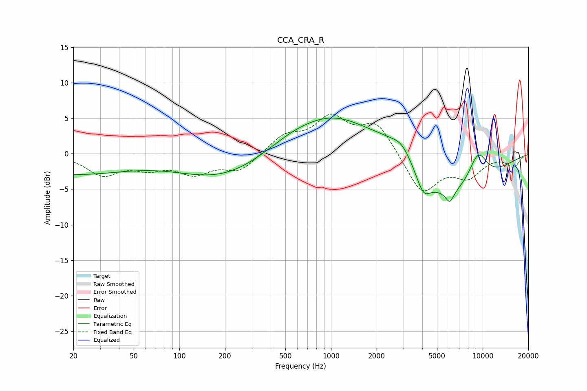

# CCA_CRA_R
See [usage instructions](https://github.com/jaakkopasanen/AutoEq#usage) for more options and info.

### Parametric EQs
Apply preamp of -5.1 dB when using parametric equalizer.

|   # | Type    |   Fc (Hz) |    Q |   Gain (dB) |
|-----|---------|-----------|------|-------------|
|   1 | Peaking |        20 | 0.39 |        -2.8 |
|   2 | Peaking |       190 | 0.49 |        -3.4 |
|   3 | Peaking |       539 | 0.86 |         0.9 |
|   4 | Peaking |      1063 | 0.51 |         5.6 |
|   5 | Peaking |      2238 | 1.23 |         1.2 |
|   6 | Peaking |      2943 | 1.96 |         2.4 |
|   7 | Peaking |      4070 | 3.11 |        -2.6 |
|   8 | Peaking |      6068 | 5.11 |        -1.7 |
|   9 | Peaking |      6116 | 0.47 |        -6.4 |
|  10 | Peaking |      9316 | 1.94 |         4.6 |

### Fixed Band EQs
When using fixed band (also called graphic) equalizer, apply preamp of **-5.7 dB** (if available) and set gains manually with these parameters.

|   # | Type    |   Fc (Hz) |    Q |   Gain (dB) |
|-----|---------|-----------|------|-------------|
|   1 | Peaking |        31 | 1.41 |        -2.8 |
|   2 | Peaking |        62 | 1.41 |        -1.6 |
|   3 | Peaking |       125 | 1.41 |        -2.5 |
|   4 | Peaking |       250 | 1.41 |        -2.4 |
|   5 | Peaking |       500 | 1.41 |         2.4 |
|   6 | Peaking |      1000 | 1.41 |         4.7 |
|   7 | Peaking |      2000 | 1.41 |         4.2 |
|   8 | Peaking |      4000 | 1.41 |        -5.7 |
|   9 | Peaking |      8000 | 1.41 |        -2.9 |
|  10 | Peaking |     16000 | 1.41 |        -1.7 |

### Graphs

