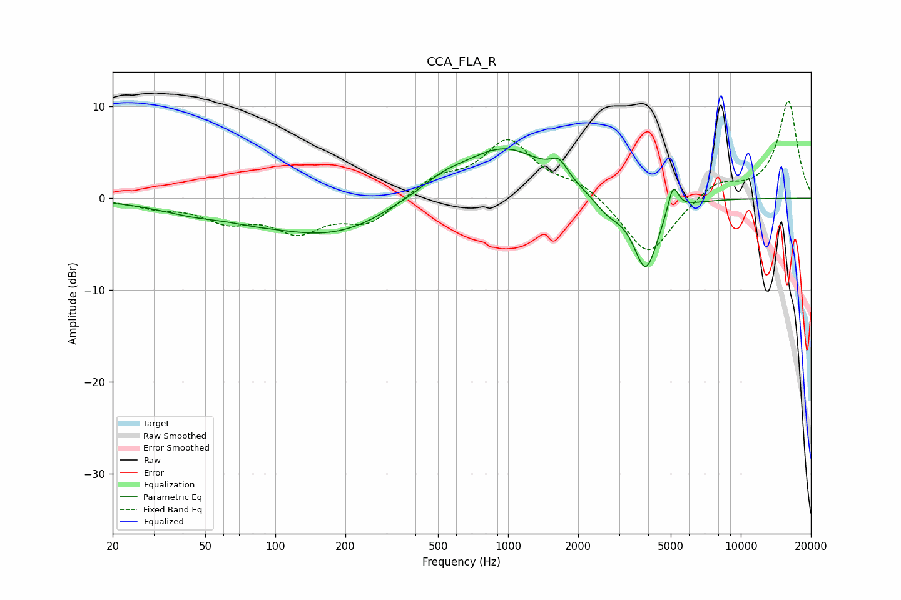

# CCA_FLA_R
See [usage instructions](https://github.com/jaakkopasanen/AutoEq#usage) for more options and info.

### Parametric EQs
Apply preamp of -5.5 dB when using parametric equalizer.

|   # | Type    |   Fc (Hz) |    Q |   Gain (dB) |
|-----|---------|-----------|------|-------------|
|   1 | Peaking |        45 | 0.87 |        -1.1 |
|   2 | Peaking |        81 | 1.5  |        -0.3 |
|   3 | Peaking |       171 | 0.51 |        -4   |
|   4 | Peaking |       325 | 1.89 |         0.2 |
|   5 | Peaking |       515 | 1.31 |         1.5 |
|   6 | Peaking |       963 | 0.77 |         5.5 |
|   7 | Peaking |      1658 | 3.81 |         1.8 |
|   8 | Peaking |      2687 | 2.2  |        -1.7 |
|   9 | Peaking |      3905 | 2.6  |        -7.8 |
|  10 | Peaking |      5113 | 5.98 |         3.2 |

### Fixed Band EQs
When using fixed band (also called graphic) equalizer, apply preamp of **-10.7 dB** (if available) and set gains manually with these parameters.

|   # | Type    |   Fc (Hz) |    Q |   Gain (dB) |
|-----|---------|-----------|------|-------------|
|   1 | Peaking |        31 | 1.41 |        -0.8 |
|   2 | Peaking |        62 | 1.41 |        -2.2 |
|   3 | Peaking |       125 | 1.41 |        -3.3 |
|   4 | Peaking |       250 | 1.41 |        -2.6 |
|   5 | Peaking |       500 | 1.41 |         2   |
|   6 | Peaking |      1000 | 1.41 |         6.1 |
|   7 | Peaking |      2000 | 1.41 |         1.5 |
|   8 | Peaking |      4000 | 1.41 |        -6.5 |
|   9 | Peaking |      8000 | 1.41 |         1.9 |
|  10 | Peaking |     16000 | 1.41 |        10.6 |

### Graphs

