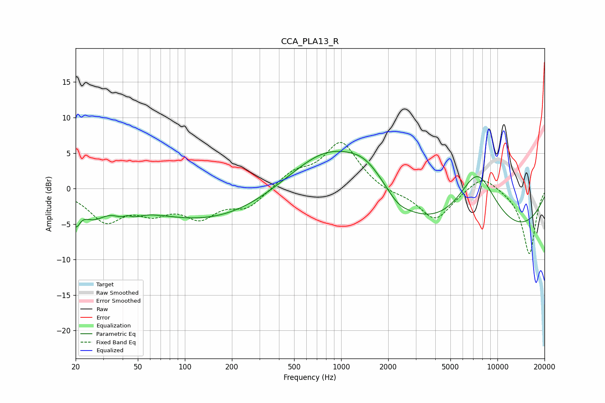

# CCA_PLA13_R
See [usage instructions](https://github.com/jaakkopasanen/AutoEq#usage) for more options and info.

### Parametric EQs
Apply preamp of -5.3 dB when using parametric equalizer.

|   # | Type    |   Fc (Hz) |    Q |   Gain (dB) |
|-----|---------|-----------|------|-------------|
|   1 | Peaking |        20 | 5.28 |        -3.1 |
|   2 | Peaking |        26 | 1.79 |        -2.7 |
|   3 | Peaking |        43 | 2.84 |        -3.8 |
|   4 | Peaking |        43 | 3.86 |         2.8 |
|   5 | Peaking |       151 | 0.32 |        -4.7 |
|   6 | Peaking |       851 | 0.52 |         7.7 |
|   7 | Peaking |      1473 | 1.07 |         3.5 |
|   8 | Peaking |      2313 | 2.26 |        -0.9 |
|   9 | Peaking |      6350 | 0.18 |        -8.6 |
|  10 | Peaking |      7430 | 0.98 |         9.8 |

### Fixed Band EQs
When using fixed band (also called graphic) equalizer, apply preamp of **-6.6 dB** (if available) and set gains manually with these parameters.

|   # | Type    |   Fc (Hz) |    Q |   Gain (dB) |
|-----|---------|-----------|------|-------------|
|   1 | Peaking |        31 | 1.41 |        -4.3 |
|   2 | Peaking |        62 | 1.41 |        -2.7 |
|   3 | Peaking |       125 | 1.41 |        -3.6 |
|   4 | Peaking |       250 | 1.41 |        -2.5 |
|   5 | Peaking |       500 | 1.41 |         2.1 |
|   6 | Peaking |      1000 | 1.41 |         6.5 |
|   7 | Peaking |      2000 | 1.41 |        -0.6 |
|   8 | Peaking |      4000 | 1.41 |        -4.5 |
|   9 | Peaking |      8000 | 1.41 |         2.2 |
|  10 | Peaking |     16000 | 1.41 |        -9.3 |

### Graphs

