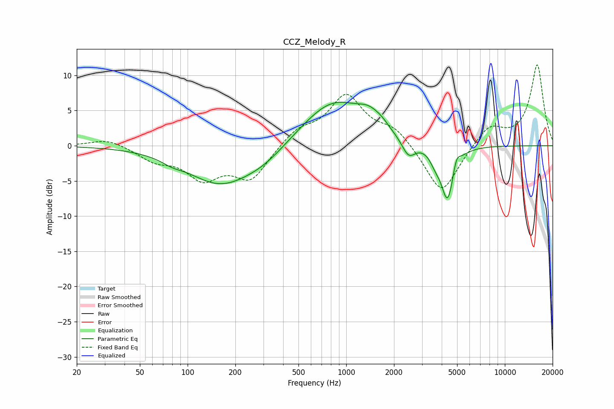

# CCZ_Melody_R
See [usage instructions](https://github.com/jaakkopasanen/AutoEq#usage) for more options and info.

### Parametric EQs
Apply preamp of -6.3 dB when using parametric equalizer.

|   # | Type    |   Fc (Hz) |    Q |   Gain (dB) |
|-----|---------|-----------|------|-------------|
|   1 | Peaking |        79 | 2.44 |        -0.5 |
|   2 | Peaking |       160 | 0.67 |        -5.3 |
|   3 | Peaking |       305 | 0.94 |        -1.7 |
|   4 | Peaking |       827 | 0.68 |         6.5 |
|   5 | Peaking |      1406 | 1.93 |         1.9 |
|   6 | Peaking |      1677 | 3.58 |         0.5 |
|   7 | Peaking |      2471 | 3.24 |        -2.6 |
|   8 | Peaking |      3635 | 4.37 |        -1.2 |
|   9 | Peaking |      4361 | 3.34 |        -8   |
|  10 | Peaking |      4942 | 6    |         2   |

### Fixed Band EQs
When using fixed band (also called graphic) equalizer, apply preamp of **-11.6 dB** (if available) and set gains manually with these parameters.

|   # | Type    |   Fc (Hz) |    Q |   Gain (dB) |
|-----|---------|-----------|------|-------------|
|   1 | Peaking |        31 | 1.41 |         1.1 |
|   2 | Peaking |        62 | 1.41 |        -1.8 |
|   3 | Peaking |       125 | 1.41 |        -4.2 |
|   4 | Peaking |       250 | 1.41 |        -4.6 |
|   5 | Peaking |       500 | 1.41 |         2.1 |
|   6 | Peaking |      1000 | 1.41 |         6.9 |
|   7 | Peaking |      2000 | 1.41 |         2.3 |
|   8 | Peaking |      4000 | 1.41 |        -7.2 |
|   9 | Peaking |      8000 | 1.41 |         2.9 |
|  10 | Peaking |     16000 | 1.41 |        11.5 |

### Graphs

