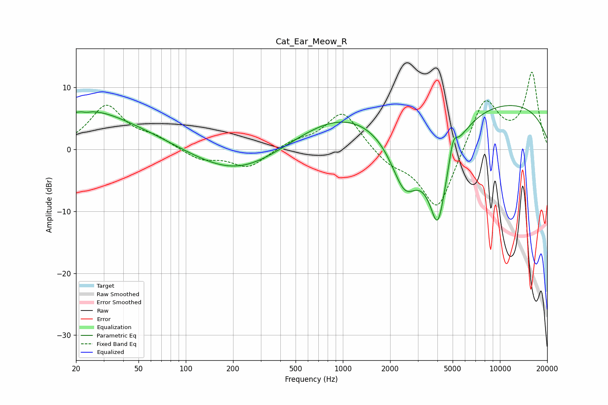

# Cat_Ear_Meow_R
See [usage instructions](https://github.com/jaakkopasanen/AutoEq#usage) for more options and info.

### Parametric EQs
Apply preamp of -7.2 dB when using parametric equalizer.

|   # | Type    |   Fc (Hz) |    Q |   Gain (dB) |
|-----|---------|-----------|------|-------------|
|   1 | Peaking |        21 | 0.3  |         5.3 |
|   2 | Peaking |        23 | 5.76 |         2.2 |
|   3 | Peaking |        23 | 5.87 |        -2.3 |
|   4 | Peaking |        28 | 0.92 |         1.1 |
|   5 | Peaking |       212 | 0.51 |        -4.3 |
|   6 | Peaking |       927 | 0.48 |         4.7 |
|   7 | Peaking |      2474 | 1.45 |        -9.9 |
|   8 | Peaking |      4027 | 1.94 |       -16.6 |
|   9 | Peaking |      5038 | 5.38 |         3.5 |
|  10 | Peaking |      8337 | 0.2  |         8.1 |

### Fixed Band EQs
When using fixed band (also called graphic) equalizer, apply preamp of **-12.5 dB** (if available) and set gains manually with these parameters.

|   # | Type    |   Fc (Hz) |    Q |   Gain (dB) |
|-----|---------|-----------|------|-------------|
|   1 | Peaking |        31 | 1.41 |         6.9 |
|   2 | Peaking |        62 | 1.41 |         1.6 |
|   3 | Peaking |       125 | 1.41 |        -1.7 |
|   4 | Peaking |       250 | 1.41 |        -3   |
|   5 | Peaking |       500 | 1.41 |         1.1 |
|   6 | Peaking |      1000 | 1.41 |         6.2 |
|   7 | Peaking |      2000 | 1.41 |        -2   |
|   8 | Peaking |      4000 | 1.41 |       -10.3 |
|   9 | Peaking |      8000 | 1.41 |         8.7 |
|  10 | Peaking |     16000 | 1.41 |        12.2 |

### Graphs

