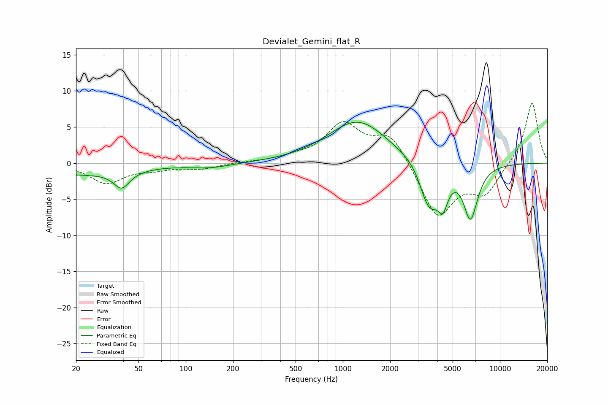

# Devialet_Gemini_flat_R
See [usage instructions](https://github.com/jaakkopasanen/AutoEq#usage) for more options and info.

### Parametric EQs
Apply preamp of -5.8 dB when using parametric equalizer.

|   # | Type    |   Fc (Hz) |    Q |   Gain (dB) |
|-----|---------|-----------|------|-------------|
|   1 | Peaking |        20 | 0.44 |        -1.5 |
|   2 | Peaking |        39 | 2.83 |        -2.4 |
|   3 | Peaking |       143 | 1.05 |        -0.6 |
|   4 | Peaking |      1235 | 0.74 |         5.2 |
|   5 | Peaking |      1322 | 0.76 |         0.7 |
|   6 | Peaking |      2936 | 1.97 |         0.8 |
|   7 | Peaking |      3529 | 2.14 |        -6.7 |
|   8 | Peaking |      4342 | 4.35 |        -3.6 |
|   9 | Peaking |      6526 | 3.29 |        -8.9 |
|  10 | Peaking |      6588 | 5.34 |         1.6 |

### Fixed Band EQs
When using fixed band (also called graphic) equalizer, apply preamp of **-8.4 dB** (if available) and set gains manually with these parameters.

|   # | Type    |   Fc (Hz) |    Q |   Gain (dB) |
|-----|---------|-----------|------|-------------|
|   1 | Peaking |        31 | 1.41 |        -2.7 |
|   2 | Peaking |        62 | 1.41 |        -0.7 |
|   3 | Peaking |       125 | 1.41 |        -0.7 |
|   4 | Peaking |       250 | 1.41 |         0.1 |
|   5 | Peaking |       500 | 1.41 |         0.6 |
|   6 | Peaking |      1000 | 1.41 |         5.2 |
|   7 | Peaking |      2000 | 1.41 |         4.1 |
|   8 | Peaking |      4000 | 1.41 |        -7.6 |
|   9 | Peaking |      8000 | 1.41 |        -3.9 |
|  10 | Peaking |     16000 | 1.41 |         8.6 |

### Graphs

