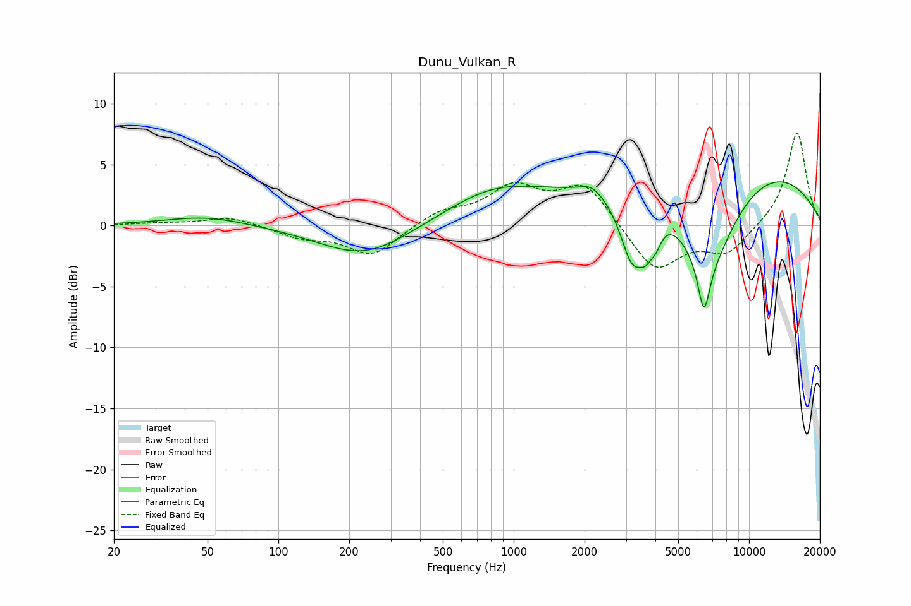

# Dunu_Vulkan_R
See [usage instructions](https://github.com/jaakkopasanen/AutoEq#usage) for more options and info.

### Parametric EQs
Apply preamp of -3.7 dB when using parametric equalizer.

|   # | Type    |   Fc (Hz) |    Q |   Gain (dB) |
|-----|---------|-----------|------|-------------|
|   1 | Peaking |        50 | 0.82 |         0.8 |
|   2 | Peaking |       232 | 0.74 |        -2.6 |
|   3 | Peaking |       823 | 0.67 |         2.6 |
|   4 | Peaking |      2138 | 3.14 |         0.7 |
|   5 | Peaking |      3184 | 2.64 |        -5.4 |
|   6 | Peaking |      3662 | 4.36 |        -2.1 |
|   7 | Peaking |      4038 | 6    |        -1.2 |
|   8 | Peaking |      6432 | 5.54 |        -4.1 |
|   9 | Peaking |      6671 | 1.05 |        -8.5 |
|  10 | Peaking |      7397 | 0.24 |         6.1 |

### Fixed Band EQs
When using fixed band (also called graphic) equalizer, apply preamp of **-7.7 dB** (if available) and set gains manually with these parameters.

|   # | Type    |   Fc (Hz) |    Q |   Gain (dB) |
|-----|---------|-----------|------|-------------|
|   1 | Peaking |        31 | 1.41 |         0.2 |
|   2 | Peaking |        62 | 1.41 |         0.7 |
|   3 | Peaking |       125 | 1.41 |        -0.9 |
|   4 | Peaking |       250 | 1.41 |        -2.5 |
|   5 | Peaking |       500 | 1.41 |         1.1 |
|   6 | Peaking |      1000 | 1.41 |         2.9 |
|   7 | Peaking |      2000 | 1.41 |         3.4 |
|   8 | Peaking |      4000 | 1.41 |        -3.8 |
|   9 | Peaking |      8000 | 1.41 |        -2.2 |
|  10 | Peaking |     16000 | 1.41 |         7.8 |

### Graphs

