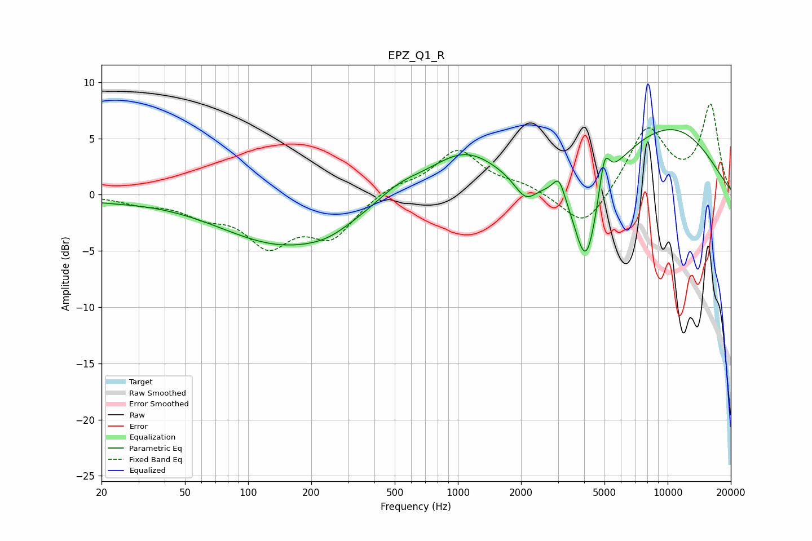

# EPZ_Q1_R
See [usage instructions](https://github.com/jaakkopasanen/AutoEq#usage) for more options and info.

### Parametric EQs
Apply preamp of -5.9 dB when using parametric equalizer.

|   # | Type    |   Fc (Hz) |    Q |   Gain (dB) |
|-----|---------|-----------|------|-------------|
|   1 | Peaking |        20 | 0.79 |        -0.4 |
|   2 | Peaking |       151 | 0.46 |        -4.4 |
|   3 | Peaking |       241 | 1.36 |        -0.6 |
|   4 | Peaking |       523 | 1.31 |         1.1 |
|   5 | Peaking |      1075 | 0.82 |         3.8 |
|   6 | Peaking |      2102 | 2.63 |        -1.9 |
|   7 | Peaking |      3032 | 4.96 |         1.8 |
|   8 | Peaking |      4085 | 2.34 |        -8.6 |
|   9 | Peaking |      4994 | 5.49 |         3.5 |
|  10 | Peaking |     10000 | 0.45 |         6   |

### Fixed Band EQs
When using fixed band (also called graphic) equalizer, apply preamp of **-8.2 dB** (if available) and set gains manually with these parameters.

|   # | Type    |   Fc (Hz) |    Q |   Gain (dB) |
|-----|---------|-----------|------|-------------|
|   1 | Peaking |        31 | 1.41 |        -0.6 |
|   2 | Peaking |        62 | 1.41 |        -1.5 |
|   3 | Peaking |       125 | 1.41 |        -4.1 |
|   4 | Peaking |       250 | 1.41 |        -3.5 |
|   5 | Peaking |       500 | 1.41 |         0.8 |
|   6 | Peaking |      1000 | 1.41 |         3.9 |
|   7 | Peaking |      2000 | 1.41 |         0.8 |
|   8 | Peaking |      4000 | 1.41 |        -3.3 |
|   9 | Peaking |      8000 | 1.41 |         5.9 |
|  10 | Peaking |     16000 | 1.41 |         7.8 |

### Graphs

