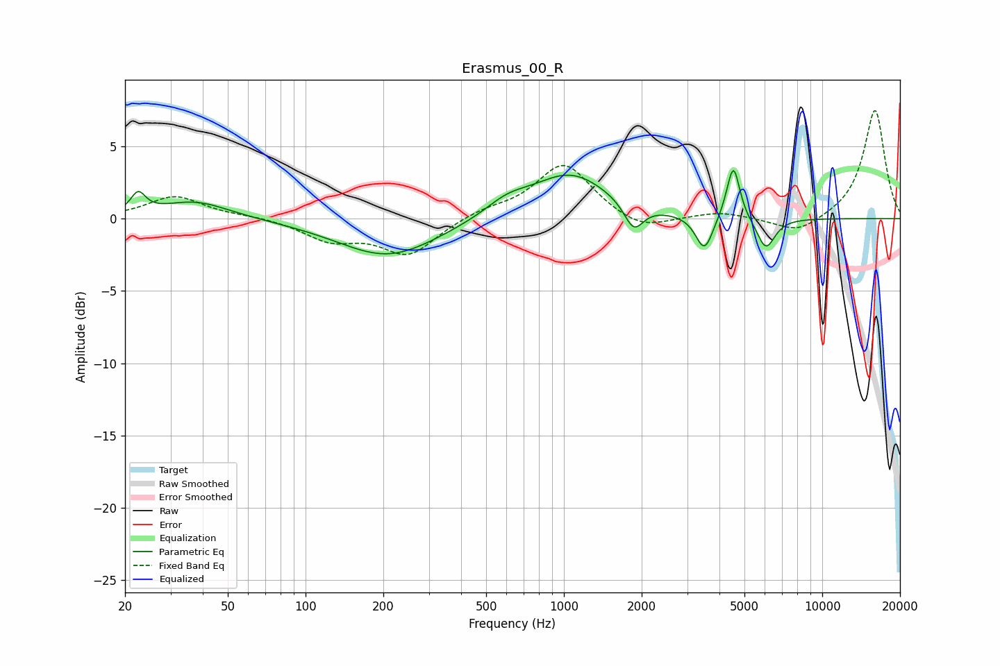

# Erasmus_00_R
See [usage instructions](https://github.com/jaakkopasanen/AutoEq#usage) for more options and info.

### Parametric EQs
Apply preamp of -3.4 dB when using parametric equalizer.

|   # | Type    |   Fc (Hz) |    Q |   Gain (dB) |
|-----|---------|-----------|------|-------------|
|   1 | Peaking |        22 | 5.03 |         1.4 |
|   2 | Peaking |        37 | 1.06 |         1.2 |
|   3 | Peaking |       209 | 0.73 |        -2.7 |
|   4 | Peaking |       601 | 1.66 |         0.9 |
|   5 | Peaking |      1058 | 0.94 |         3.1 |
|   6 | Peaking |      1863 | 3.84 |        -1.9 |
|   7 | Peaking |      3499 | 4.24 |        -2.5 |
|   8 | Peaking |      4419 | 4.51 |         0.6 |
|   9 | Peaking |      4539 | 5.91 |         3.2 |
|  10 | Peaking |      6049 | 3.93 |        -2.2 |

### Fixed Band EQs
When using fixed band (also called graphic) equalizer, apply preamp of **-7.6 dB** (if available) and set gains manually with these parameters.

|   # | Type    |   Fc (Hz) |    Q |   Gain (dB) |
|-----|---------|-----------|------|-------------|
|   1 | Peaking |        31 | 1.41 |         1.5 |
|   2 | Peaking |        62 | 1.41 |         0.2 |
|   3 | Peaking |       125 | 1.41 |        -1.4 |
|   4 | Peaking |       250 | 1.41 |        -2.5 |
|   5 | Peaking |       500 | 1.41 |         0.5 |
|   6 | Peaking |      1000 | 1.41 |         3.8 |
|   7 | Peaking |      2000 | 1.41 |        -1   |
|   8 | Peaking |      4000 | 1.41 |         0.5 |
|   9 | Peaking |      8000 | 1.41 |        -1.1 |
|  10 | Peaking |     16000 | 1.41 |         7.6 |

### Graphs

