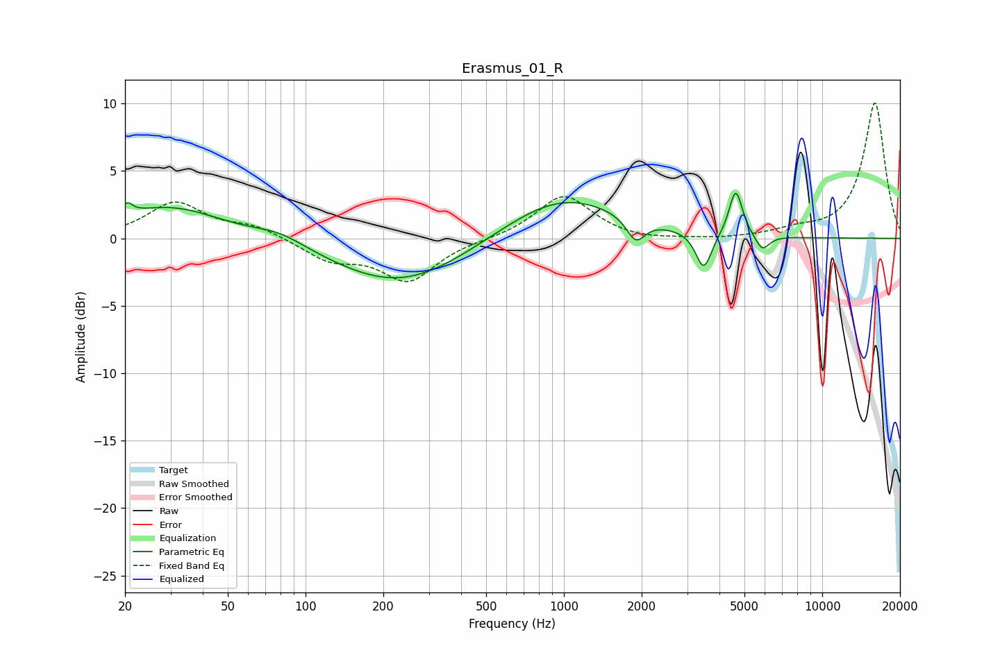

# Erasmus_01_R
See [usage instructions](https://github.com/jaakkopasanen/AutoEq#usage) for more options and info.

### Parametric EQs
Apply preamp of -3.5 dB when using parametric equalizer.

|   # | Type    |   Fc (Hz) |    Q |   Gain (dB) |
|-----|---------|-----------|------|-------------|
|   1 | Peaking |        21 | 5.96 |         2.5 |
|   2 | Peaking |        21 | 6    |        -1.7 |
|   3 | Peaking |        30 | 0.7  |         2.4 |
|   4 | Peaking |        80 | 1.35 |         0.8 |
|   5 | Peaking |       233 | 0.54 |        -3.5 |
|   6 | Peaking |       983 | 0.62 |         3.3 |
|   7 | Peaking |      1899 | 4.01 |        -1.7 |
|   8 | Peaking |      3478 | 4.63 |        -2.8 |
|   9 | Peaking |      4627 | 5.48 |         3.5 |
|  10 | Peaking |      5862 | 5.15 |        -1.2 |

### Fixed Band EQs
When using fixed band (also called graphic) equalizer, apply preamp of **-10.1 dB** (if available) and set gains manually with these parameters.

|   # | Type    |   Fc (Hz) |    Q |   Gain (dB) |
|-----|---------|-----------|------|-------------|
|   1 | Peaking |        31 | 1.41 |         2.6 |
|   2 | Peaking |        62 | 1.41 |         0.9 |
|   3 | Peaking |       125 | 1.41 |        -1.5 |
|   4 | Peaking |       250 | 1.41 |        -3.1 |
|   5 | Peaking |       500 | 1.41 |        -0.1 |
|   6 | Peaking |      1000 | 1.41 |         3.2 |
|   7 | Peaking |      2000 | 1.41 |        -0.2 |
|   8 | Peaking |      4000 | 1.41 |        -0.1 |
|   9 | Peaking |      8000 | 1.41 |         0.5 |
|  10 | Peaking |     16000 | 1.41 |        10.1 |

### Graphs

