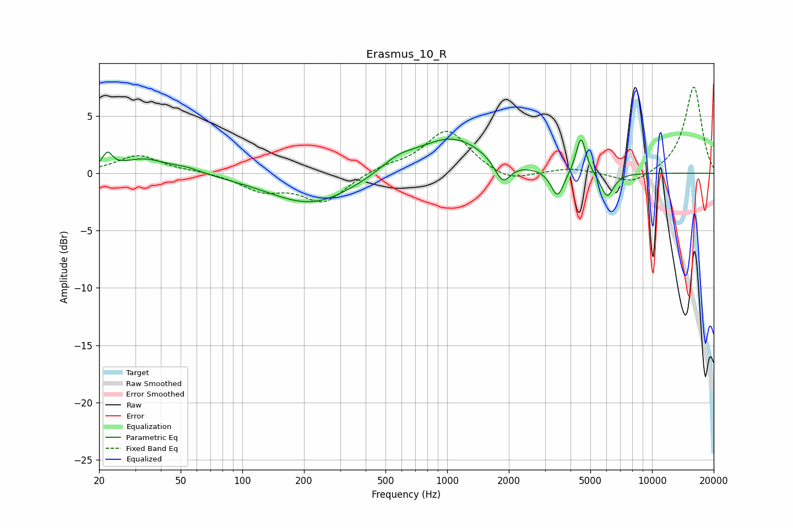

# Erasmus_10_R
See [usage instructions](https://github.com/jaakkopasanen/AutoEq#usage) for more options and info.

### Parametric EQs
Apply preamp of -3.1 dB when using parametric equalizer.

|   # | Type    |   Fc (Hz) |    Q |   Gain (dB) |
|-----|---------|-----------|------|-------------|
|   1 | Peaking |        22 | 6    |         1.3 |
|   2 | Peaking |        33 | 1.32 |         1.2 |
|   3 | Peaking |        53 | 1.78 |         0.4 |
|   4 | Peaking |       219 | 0.67 |        -2.8 |
|   5 | Peaking |       575 | 1.6  |         1   |
|   6 | Peaking |      1053 | 0.84 |         3.1 |
|   7 | Peaking |      1865 | 3.65 |        -2   |
|   8 | Peaking |      3456 | 4.51 |        -2.4 |
|   9 | Peaking |      4500 | 5.88 |         3.3 |
|  10 | Peaking |      6039 | 4.3  |        -2.2 |

### Fixed Band EQs
When using fixed band (also called graphic) equalizer, apply preamp of **-7.6 dB** (if available) and set gains manually with these parameters.

|   # | Type    |   Fc (Hz) |    Q |   Gain (dB) |
|-----|---------|-----------|------|-------------|
|   1 | Peaking |        31 | 1.41 |         1.6 |
|   2 | Peaking |        62 | 1.41 |         0.1 |
|   3 | Peaking |       125 | 1.41 |        -1.4 |
|   4 | Peaking |       250 | 1.41 |        -2.5 |
|   5 | Peaking |       500 | 1.41 |         0.6 |
|   6 | Peaking |      1000 | 1.41 |         3.8 |
|   7 | Peaking |      2000 | 1.41 |        -0.9 |
|   8 | Peaking |      4000 | 1.41 |         0.4 |
|   9 | Peaking |      8000 | 1.41 |        -1.1 |
|  10 | Peaking |     16000 | 1.41 |         7.6 |

### Graphs

