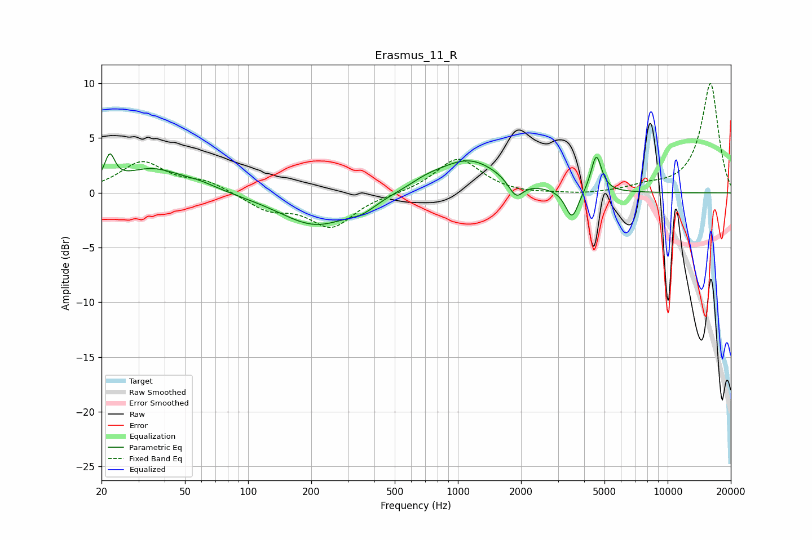

# Erasmus_11_R
See [usage instructions](https://github.com/jaakkopasanen/AutoEq#usage) for more options and info.

### Parametric EQs
Apply preamp of -3.7 dB when using parametric equalizer.

|   # | Type    |   Fc (Hz) |    Q |   Gain (dB) |
|-----|---------|-----------|------|-------------|
|   1 | Peaking |        22 | 5.99 |         2.5 |
|   2 | Peaking |        35 | 1.01 |         2.1 |
|   3 | Peaking |        58 | 1.47 |         0.5 |
|   4 | Peaking |       210 | 0.83 |        -3   |
|   5 | Peaking |       351 | 2.15 |        -0.7 |
|   6 | Peaking |       709 | 1.76 |         0.5 |
|   7 | Peaking |      1129 | 0.94 |         3   |
|   8 | Peaking |      1892 | 4.04 |        -1.6 |
|   9 | Peaking |      3502 | 4.54 |        -2.7 |
|  10 | Peaking |      4568 | 5.63 |         3.4 |

### Fixed Band EQs
When using fixed band (also called graphic) equalizer, apply preamp of **-10.1 dB** (if available) and set gains manually with these parameters.

|   # | Type    |   Fc (Hz) |    Q |   Gain (dB) |
|-----|---------|-----------|------|-------------|
|   1 | Peaking |        31 | 1.41 |         2.7 |
|   2 | Peaking |        62 | 1.41 |         1   |
|   3 | Peaking |       125 | 1.41 |        -1.4 |
|   4 | Peaking |       250 | 1.41 |        -3   |
|   5 | Peaking |       500 | 1.41 |        -0.1 |
|   6 | Peaking |      1000 | 1.41 |         3.2 |
|   7 | Peaking |      2000 | 1.41 |        -0.2 |
|   8 | Peaking |      4000 | 1.41 |        -0.2 |
|   9 | Peaking |      8000 | 1.41 |         0.5 |
|  10 | Peaking |     16000 | 1.41 |        10   |

### Graphs

