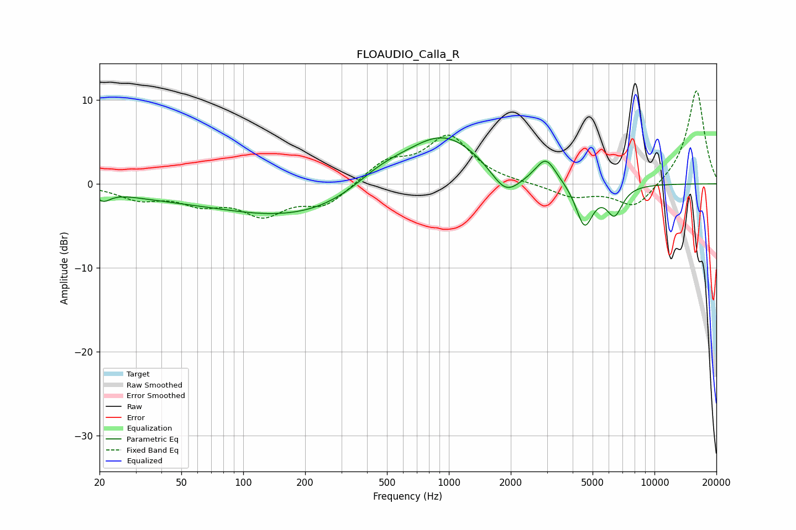

# FLOAUDIO_Calla_R
See [usage instructions](https://github.com/jaakkopasanen/AutoEq#usage) for more options and info.

### Parametric EQs
Apply preamp of -5.6 dB when using parametric equalizer.

|   # | Type    |   Fc (Hz) |    Q |   Gain (dB) |
|-----|---------|-----------|------|-------------|
|   1 | Peaking |        21 | 4.09 |        -1.1 |
|   2 | Peaking |        38 | 0.63 |        -0.9 |
|   3 | Peaking |       197 | 0.34 |        -4.1 |
|   4 | Peaking |       463 | 0.97 |         2.3 |
|   5 | Peaking |       935 | 0.71 |         6.3 |
|   6 | Peaking |      1890 | 1.94 |        -3.2 |
|   7 | Peaking |      2960 | 2.93 |         2.8 |
|   8 | Peaking |      3868 | 2.06 |         0   |
|   9 | Peaking |      4564 | 3.35 |        -5.1 |
|  10 | Peaking |      6393 | 3.49 |        -3.4 |

### Fixed Band EQs
When using fixed band (also called graphic) equalizer, apply preamp of **-11.2 dB** (if available) and set gains manually with these parameters.

|   # | Type    |   Fc (Hz) |    Q |   Gain (dB) |
|-----|---------|-----------|------|-------------|
|   1 | Peaking |        31 | 1.41 |        -1.6 |
|   2 | Peaking |        62 | 1.41 |        -2   |
|   3 | Peaking |       125 | 1.41 |        -3.3 |
|   4 | Peaking |       250 | 1.41 |        -2.5 |
|   5 | Peaking |       500 | 1.41 |         2.5 |
|   6 | Peaking |      1000 | 1.41 |         5.5 |
|   7 | Peaking |      2000 | 1.41 |         0   |
|   8 | Peaking |      4000 | 1.41 |        -1.5 |
|   9 | Peaking |      8000 | 1.41 |        -3   |
|  10 | Peaking |     16000 | 1.41 |        11.3 |

### Graphs

