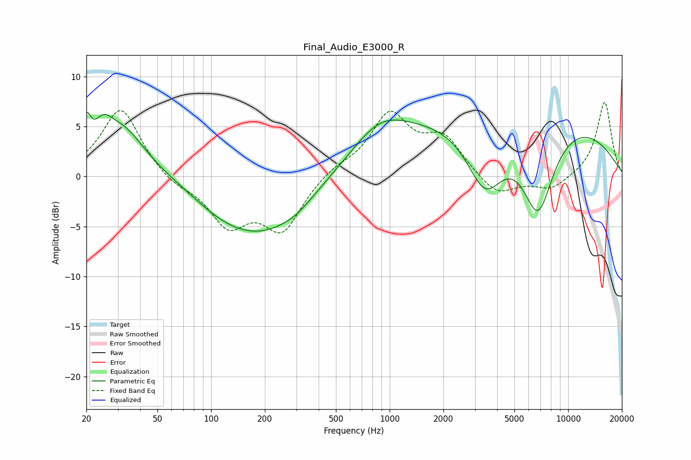

# Final_Audio_E3000_R
See [usage instructions](https://github.com/jaakkopasanen/AutoEq#usage) for more options and info.

### Parametric EQs
Apply preamp of -6.5 dB when using parametric equalizer.

|   # | Type    |   Fc (Hz) |    Q |   Gain (dB) |
|-----|---------|-----------|------|-------------|
|   1 | Peaking |        20 | 5.87 |         3.1 |
|   2 | Peaking |        25 | 2.96 |         2   |
|   3 | Peaking |        31 | 1.02 |         5   |
|   4 | Peaking |       111 | 0.94 |        -1.1 |
|   5 | Peaking |       190 | 0.58 |        -5.3 |
|   6 | Peaking |       300 | 1.51 |        -0.7 |
|   7 | Peaking |       877 | 0.87 |         3.4 |
|   8 | Peaking |      3425 | 1.3  |        -6.9 |
|   9 | Peaking |      5069 | 0.2  |         7.2 |
|  10 | Peaking |      6772 | 1.47 |        -9.1 |

### Fixed Band EQs
When using fixed band (also called graphic) equalizer, apply preamp of **-7.5 dB** (if available) and set gains manually with these parameters.

|   # | Type    |   Fc (Hz) |    Q |   Gain (dB) |
|-----|---------|-----------|------|-------------|
|   1 | Peaking |        31 | 1.41 |         7   |
|   2 | Peaking |        62 | 1.41 |        -0.9 |
|   3 | Peaking |       125 | 1.41 |        -4.6 |
|   4 | Peaking |       250 | 1.41 |        -5.2 |
|   5 | Peaking |       500 | 1.41 |         0.9 |
|   6 | Peaking |      1000 | 1.41 |         6   |
|   7 | Peaking |      2000 | 1.41 |         3.6 |
|   8 | Peaking |      4000 | 1.41 |        -2.1 |
|   9 | Peaking |      8000 | 1.41 |        -1.4 |
|  10 | Peaking |     16000 | 1.41 |         7.5 |

### Graphs

