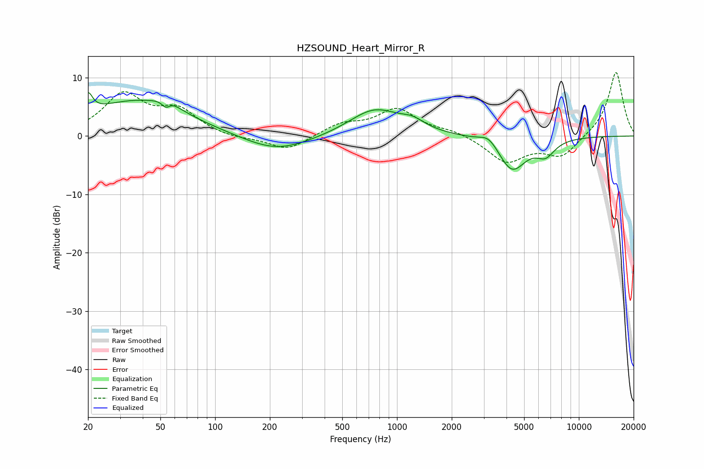

# HZSOUND_Heart_Mirror_R
See [usage instructions](https://github.com/jaakkopasanen/AutoEq#usage) for more options and info.

### Parametric EQs
Apply preamp of -7.5 dB when using parametric equalizer.

|   # | Type    |   Fc (Hz) |    Q |   Gain (dB) |
|-----|---------|-----------|------|-------------|
|   1 | Peaking |        20 | 5.83 |         3.3 |
|   2 | Peaking |        37 | 0.5  |         6   |
|   3 | Peaking |        54 | 5.9  |        -1.6 |
|   4 | Peaking |        55 | 2.6  |         1.7 |
|   5 | Peaking |       217 | 0.76 |        -2.9 |
|   6 | Peaking |       754 | 1    |         4.6 |
|   7 | Peaking |      1221 | 2.16 |         1.4 |
|   8 | Peaking |      3203 | 2.78 |         1.7 |
|   9 | Peaking |      4288 | 1.82 |        -5.9 |
|  10 | Peaking |      6569 | 2.71 |        -2.5 |

### Fixed Band EQs
When using fixed band (also called graphic) equalizer, apply preamp of **-11.0 dB** (if available) and set gains manually with these parameters.

|   # | Type    |   Fc (Hz) |    Q |   Gain (dB) |
|-----|---------|-----------|------|-------------|
|   1 | Peaking |        31 | 1.41 |         6.9 |
|   2 | Peaking |        62 | 1.41 |         4   |
|   3 | Peaking |       125 | 1.41 |        -0.5 |
|   4 | Peaking |       250 | 1.41 |        -2.5 |
|   5 | Peaking |       500 | 1.41 |         1.9 |
|   6 | Peaking |      1000 | 1.41 |         4.5 |
|   7 | Peaking |      2000 | 1.41 |         0.8 |
|   8 | Peaking |      4000 | 1.41 |        -4.4 |
|   9 | Peaking |      8000 | 1.41 |        -3.5 |
|  10 | Peaking |     16000 | 1.41 |        11.2 |

### Graphs

