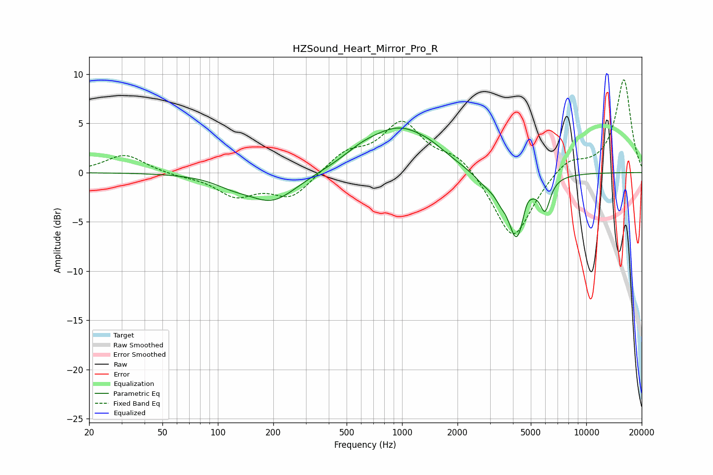

# HZSound_Heart_Mirror_Pro_R
See [usage instructions](https://github.com/jaakkopasanen/AutoEq#usage) for more options and info.

### Parametric EQs
Apply preamp of -4.6 dB when using parametric equalizer.

|   # | Type    |   Fc (Hz) |    Q |   Gain (dB) |
|-----|---------|-----------|------|-------------|
|   1 | Peaking |       118 | 1.53 |        -0.6 |
|   2 | Peaking |       197 | 1.04 |        -3   |
|   3 | Peaking |       597 | 1.39 |         0.8 |
|   4 | Peaking |       972 | 0.82 |         4.3 |
|   5 | Peaking |      1425 | 1.84 |         0.5 |
|   6 | Peaking |      2891 | 1.87 |        -1.3 |
|   7 | Peaking |      3426 | 5.14 |        -0.7 |
|   8 | Peaking |      4193 | 2.97 |        -6.5 |
|   9 | Peaking |      4750 | 6    |         1   |
|  10 | Peaking |      5976 | 4.96 |        -3   |

### Fixed Band EQs
When using fixed band (also called graphic) equalizer, apply preamp of **-9.5 dB** (if available) and set gains manually with these parameters.

|   # | Type    |   Fc (Hz) |    Q |   Gain (dB) |
|-----|---------|-----------|------|-------------|
|   1 | Peaking |        31 | 1.41 |         1.9 |
|   2 | Peaking |        62 | 1.41 |        -0.3 |
|   3 | Peaking |       125 | 1.41 |        -2.2 |
|   4 | Peaking |       250 | 1.41 |        -2.5 |
|   5 | Peaking |       500 | 1.41 |         1.9 |
|   6 | Peaking |      1000 | 1.41 |         4.9 |
|   7 | Peaking |      2000 | 1.41 |         1.8 |
|   8 | Peaking |      4000 | 1.41 |        -7   |
|   9 | Peaking |      8000 | 1.41 |         1.5 |
|  10 | Peaking |     16000 | 1.41 |         9.5 |

### Graphs

