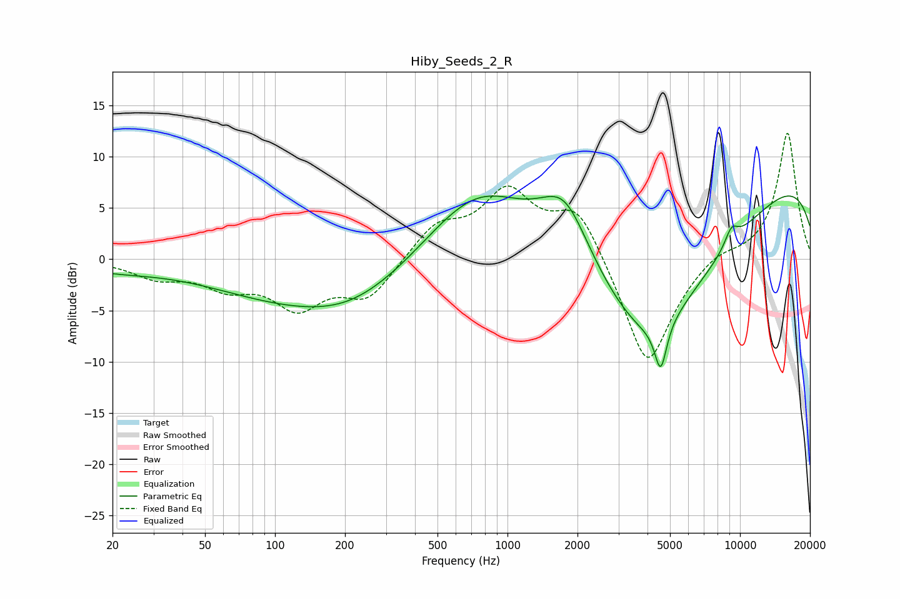

# Hiby_Seeds_2_R
See [usage instructions](https://github.com/jaakkopasanen/AutoEq#usage) for more options and info.

### Parametric EQs
Apply preamp of -6.3 dB when using parametric equalizer.

|   # | Type    |   Fc (Hz) |    Q |   Gain (dB) |
|-----|---------|-----------|------|-------------|
|   1 | Peaking |        20 | 0.76 |        -0.8 |
|   2 | Peaking |       186 | 0.3  |        -5.1 |
|   3 | Peaking |       218 | 0.75 |        -1.2 |
|   4 | Peaking |       360 | 1.48 |        -0.1 |
|   5 | Peaking |       754 | 0.52 |         9.6 |
|   6 | Peaking |      1765 | 1.23 |         6.9 |
|   7 | Peaking |      4053 | 0.42 |       -16.3 |
|   8 | Peaking |      4559 | 5.45 |        -4.6 |
|   9 | Peaking |      9189 | 4.28 |         1.7 |
|  10 | Peaking |     10000 | 0.18 |         9.9 |

### Fixed Band EQs
When using fixed band (also called graphic) equalizer, apply preamp of **-12.4 dB** (if available) and set gains manually with these parameters.

|   # | Type    |   Fc (Hz) |    Q |   Gain (dB) |
|-----|---------|-----------|------|-------------|
|   1 | Peaking |        31 | 1.41 |        -1.6 |
|   2 | Peaking |        62 | 1.41 |        -2.3 |
|   3 | Peaking |       125 | 1.41 |        -4.3 |
|   4 | Peaking |       250 | 1.41 |        -3.7 |
|   5 | Peaking |       500 | 1.41 |         3.1 |
|   6 | Peaking |      1000 | 1.41 |         6.2 |
|   7 | Peaking |      2000 | 1.41 |         5.2 |
|   8 | Peaking |      4000 | 1.41 |       -11   |
|   9 | Peaking |      8000 | 1.41 |         1   |
|  10 | Peaking |     16000 | 1.41 |        12.4 |

### Graphs

