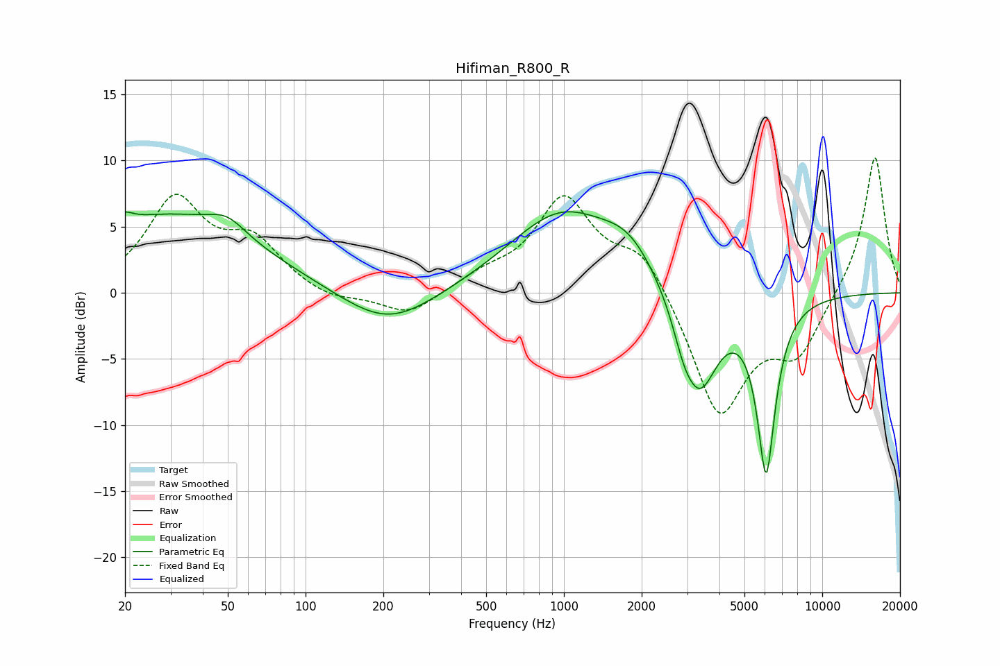

# Hifiman_R800_R
See [usage instructions](https://github.com/jaakkopasanen/AutoEq#usage) for more options and info.

### Parametric EQs
Apply preamp of -6.2 dB when using parametric equalizer.

|   # | Type    |   Fc (Hz) |    Q |   Gain (dB) |
|-----|---------|-----------|------|-------------|
|   1 | Peaking |        20 | 5.58 |         3.4 |
|   2 | Peaking |        20 | 5.98 |        -2.7 |
|   3 | Peaking |        29 | 0.4  |         5.8 |
|   4 | Peaking |        50 | 1.99 |         1.3 |
|   5 | Peaking |       208 | 0.79 |        -2.9 |
|   6 | Peaking |       976 | 0.69 |         5.9 |
|   7 | Peaking |      1791 | 1.3  |         2.4 |
|   8 | Peaking |      2896 | 3.54 |        -1.6 |
|   9 | Peaking |      3346 | 1.89 |        -7.5 |
|  10 | Peaking |      6066 | 3.77 |       -13   |

### Fixed Band EQs
When using fixed band (also called graphic) equalizer, apply preamp of **-10.3 dB** (if available) and set gains manually with these parameters.

|   # | Type    |   Fc (Hz) |    Q |   Gain (dB) |
|-----|---------|-----------|------|-------------|
|   1 | Peaking |        31 | 1.41 |         6.8 |
|   2 | Peaking |        62 | 1.41 |         3.5 |
|   3 | Peaking |       125 | 1.41 |        -0.7 |
|   4 | Peaking |       250 | 1.41 |        -1.8 |
|   5 | Peaking |       500 | 1.41 |         1.1 |
|   6 | Peaking |      1000 | 1.41 |         7   |
|   7 | Peaking |      2000 | 1.41 |         3.3 |
|   8 | Peaking |      4000 | 1.41 |        -9.4 |
|   9 | Peaking |      8000 | 1.41 |        -4.3 |
|  10 | Peaking |     16000 | 1.41 |        10.6 |

### Graphs

