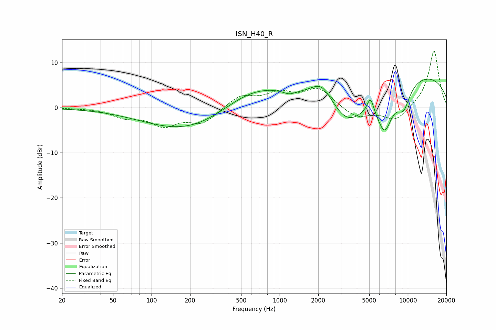

# ISN_H40_R
See [usage instructions](https://github.com/jaakkopasanen/AutoEq#usage) for more options and info.

### Parametric EQs
Apply preamp of -6.4 dB when using parametric equalizer.

|   # | Type    |   Fc (Hz) |    Q |   Gain (dB) |
|-----|---------|-----------|------|-------------|
|   1 | Peaking |       237 | 0.38 |        -5.7 |
|   2 | Peaking |       256 | 0.36 |        -1.4 |
|   3 | Peaking |       588 | 0.45 |         7.3 |
|   4 | Peaking |      1185 | 3.05 |        -0.8 |
|   5 | Peaking |      2135 | 1.56 |         4.9 |
|   6 | Peaking |      3379 | 0.84 |        -8.9 |
|   7 | Peaking |      5108 | 5.4  |         3.5 |
|   8 | Peaking |      6593 | 2.17 |        -8.8 |
|   9 | Peaking |      9250 | 2.33 |        -5.2 |
|  10 | Peaking |     10000 | 0.21 |         7.9 |

### Fixed Band EQs
When using fixed band (also called graphic) equalizer, apply preamp of **-12.7 dB** (if available) and set gains manually with these parameters.

|   # | Type    |   Fc (Hz) |    Q |   Gain (dB) |
|-----|---------|-----------|------|-------------|
|   1 | Peaking |        31 | 1.41 |        -0   |
|   2 | Peaking |        62 | 1.41 |        -1.9 |
|   3 | Peaking |       125 | 1.41 |        -3.6 |
|   4 | Peaking |       250 | 1.41 |        -3.3 |
|   5 | Peaking |       500 | 1.41 |         2.7 |
|   6 | Peaking |      1000 | 1.41 |         2.9 |
|   7 | Peaking |      2000 | 1.41 |         4.2 |
|   8 | Peaking |      4000 | 1.41 |        -2.4 |
|   9 | Peaking |      8000 | 1.41 |        -3.1 |
|  10 | Peaking |     16000 | 1.41 |        12.8 |

### Graphs

