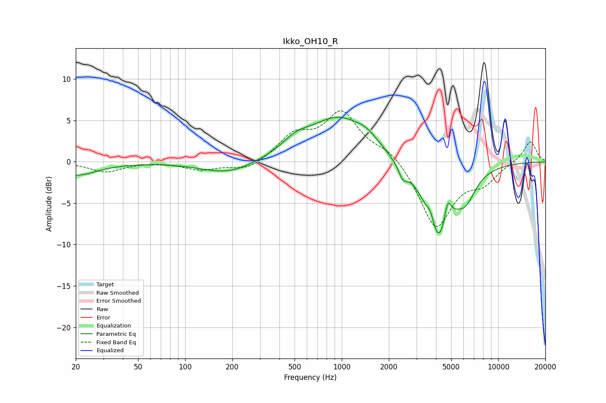

# Ikko_OH10_R
See [usage instructions](https://github.com/jaakkopasanen/AutoEq#usage) for more options and info.

### Parametric EQs
Apply preamp of -5.5 dB when using parametric equalizer.

|   # | Type    |   Fc (Hz) |    Q |   Gain (dB) |
|-----|---------|-----------|------|-------------|
|   1 | Peaking |        20 | 1.06 |        -1.6 |
|   2 | Peaking |       187 | 0.84 |        -1.5 |
|   3 | Peaking |       508 | 1.58 |         1.4 |
|   4 | Peaking |       940 | 0.77 |         5.1 |
|   5 | Peaking |      1450 | 1.78 |         1.2 |
|   6 | Peaking |      2459 | 5.09 |        -1.5 |
|   7 | Peaking |      3701 | 5.99 |         1.5 |
|   8 | Peaking |      4167 | 1.69 |        -9.8 |
|   9 | Peaking |      4747 | 6    |         3.2 |
|  10 | Peaking |      6219 | 2.23 |        -2.7 |

### Fixed Band EQs
When using fixed band (also called graphic) equalizer, apply preamp of **-6.3 dB** (if available) and set gains manually with these parameters.

|   # | Type    |   Fc (Hz) |    Q |   Gain (dB) |
|-----|---------|-----------|------|-------------|
|   1 | Peaking |        31 | 1.41 |        -1.2 |
|   2 | Peaking |        62 | 1.41 |         0.1 |
|   3 | Peaking |       125 | 1.41 |        -0.9 |
|   4 | Peaking |       250 | 1.41 |        -1.1 |
|   5 | Peaking |       500 | 1.41 |         2.9 |
|   6 | Peaking |      1000 | 1.41 |         5.7 |
|   7 | Peaking |      2000 | 1.41 |         1.5 |
|   8 | Peaking |      4000 | 1.41 |        -8   |
|   9 | Peaking |      8000 | 1.41 |        -2.1 |
|  10 | Peaking |     16000 | 1.41 |         2.6 |

### Graphs

