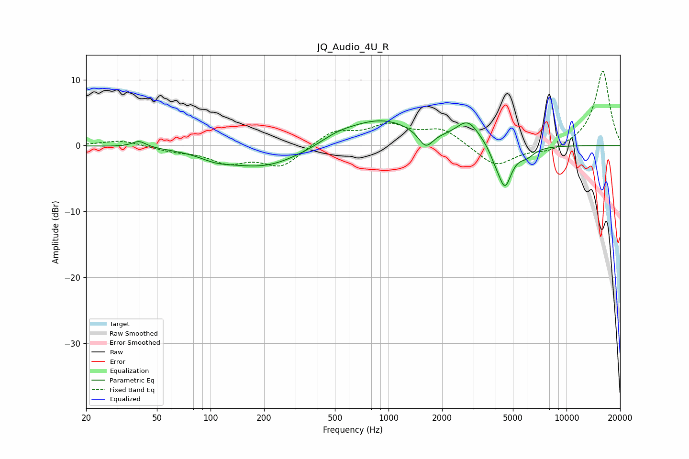

# JQ_Audio_4U_R
See [usage instructions](https://github.com/jaakkopasanen/AutoEq#usage) for more options and info.

### Parametric EQs
Apply preamp of -3.9 dB when using parametric equalizer.

|   # | Type    |   Fc (Hz) |    Q |   Gain (dB) |
|-----|---------|-----------|------|-------------|
|   1 | Peaking |        40 | 3.64 |         1   |
|   2 | Peaking |       107 | 1.64 |        -0.8 |
|   3 | Peaking |       200 | 0.63 |        -3.3 |
|   4 | Peaking |       516 | 1.5  |         0.8 |
|   5 | Peaking |       902 | 0.69 |         4   |
|   6 | Peaking |      1619 | 3.5  |        -2.5 |
|   7 | Peaking |      2793 | 2.18 |         3.3 |
|   8 | Peaking |      3957 | 4.77 |        -1   |
|   9 | Peaking |      4500 | 3.57 |        -6.2 |
|  10 | Peaking |      5957 | 2.97 |        -1.3 |

### Fixed Band EQs
When using fixed band (also called graphic) equalizer, apply preamp of **-11.4 dB** (if available) and set gains manually with these parameters.

|   # | Type    |   Fc (Hz) |    Q |   Gain (dB) |
|-----|---------|-----------|------|-------------|
|   1 | Peaking |        31 | 1.41 |         0.9 |
|   2 | Peaking |        62 | 1.41 |        -0.7 |
|   3 | Peaking |       125 | 1.41 |        -2.3 |
|   4 | Peaking |       250 | 1.41 |        -3.1 |
|   5 | Peaking |       500 | 1.41 |         2.2 |
|   6 | Peaking |      1000 | 1.41 |         2.8 |
|   7 | Peaking |      2000 | 1.41 |         2.4 |
|   8 | Peaking |      4000 | 1.41 |        -3.3 |
|   9 | Peaking |      8000 | 1.41 |        -1   |
|  10 | Peaking |     16000 | 1.41 |        11.5 |

### Graphs

