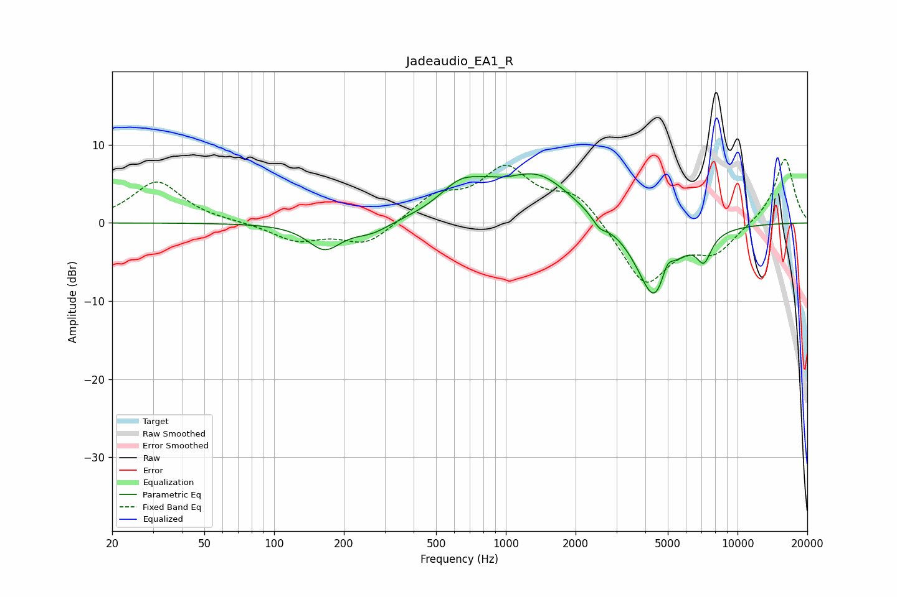

# Jadeaudio_EA1_R
See [usage instructions](https://github.com/jaakkopasanen/AutoEq#usage) for more options and info.

### Parametric EQs
Apply preamp of -6.4 dB when using parametric equalizer.

|   # | Type    |   Fc (Hz) |    Q |   Gain (dB) |
|-----|---------|-----------|------|-------------|
|   1 | Peaking |       165 | 1.96 |        -3.3 |
|   2 | Peaking |       264 | 1.77 |        -1.3 |
|   3 | Peaking |       640 | 1.48 |         3.7 |
|   4 | Peaking |       840 | 2.36 |         0.7 |
|   5 | Peaking |      1365 | 0.9  |         6   |
|   6 | Peaking |      2537 | 4.6  |        -1.2 |
|   7 | Peaking |      4399 | 1.77 |       -10.5 |
|   8 | Peaking |      4961 | 3.62 |         0.4 |
|   9 | Peaking |      4970 | 5.29 |         2.2 |
|  10 | Peaking |      7167 | 4.3  |        -3.3 |

### Fixed Band EQs
When using fixed band (also called graphic) equalizer, apply preamp of **-8.2 dB** (if available) and set gains manually with these parameters.

|   # | Type    |   Fc (Hz) |    Q |   Gain (dB) |
|-----|---------|-----------|------|-------------|
|   1 | Peaking |        31 | 1.41 |         5.3 |
|   2 | Peaking |        62 | 1.41 |         0.1 |
|   3 | Peaking |       125 | 1.41 |        -2.2 |
|   4 | Peaking |       250 | 1.41 |        -2.8 |
|   5 | Peaking |       500 | 1.41 |         3.2 |
|   6 | Peaking |      1000 | 1.41 |         6.5 |
|   7 | Peaking |      2000 | 1.41 |         3.7 |
|   8 | Peaking |      4000 | 1.41 |        -8   |
|   9 | Peaking |      8000 | 1.41 |        -3.4 |
|  10 | Peaking |     16000 | 1.41 |         8.4 |

### Graphs

