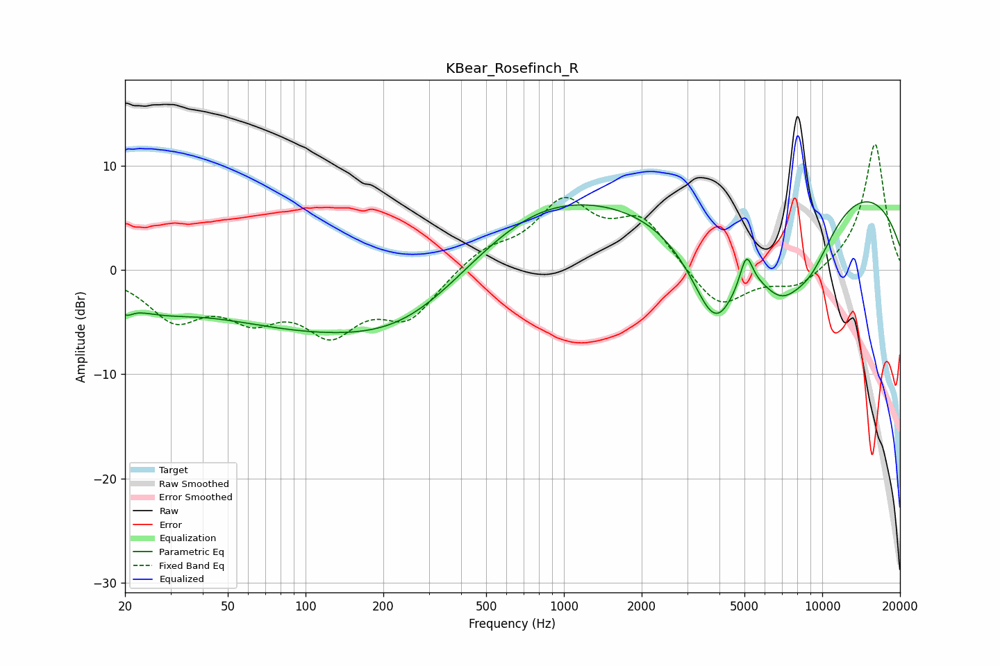

# KBear_Rosefinch_R
See [usage instructions](https://github.com/jaakkopasanen/AutoEq#usage) for more options and info.

### Parametric EQs
Apply preamp of -6.6 dB when using parametric equalizer.

|   # | Type    |   Fc (Hz) |    Q |   Gain (dB) |
|-----|---------|-----------|------|-------------|
|   1 | Peaking |        20 | 4.99 |        -1.2 |
|   2 | Peaking |        25 | 0.93 |        -2.1 |
|   3 | Peaking |       176 | 0.22 |        -6.3 |
|   4 | Peaking |       255 | 0.61 |        -2.7 |
|   5 | Peaking |       740 | 0.38 |         8.7 |
|   6 | Peaking |      3857 | 1.25 |       -11.3 |
|   7 | Peaking |      5084 | 5.75 |         3.1 |
|   8 | Peaking |      6882 | 1.42 |        -5.5 |
|   9 | Peaking |      8983 | 1.17 |        -5.9 |
|  10 | Peaking |      9336 | 0.21 |         9.4 |

### Fixed Band EQs
When using fixed band (also called graphic) equalizer, apply preamp of **-12.2 dB** (if available) and set gains manually with these parameters.

|   # | Type    |   Fc (Hz) |    Q |   Gain (dB) |
|-----|---------|-----------|------|-------------|
|   1 | Peaking |        31 | 1.41 |        -4.3 |
|   2 | Peaking |        62 | 1.41 |        -3.7 |
|   3 | Peaking |       125 | 1.41 |        -5.2 |
|   4 | Peaking |       250 | 1.41 |        -4.3 |
|   5 | Peaking |       500 | 1.41 |         1.8 |
|   6 | Peaking |      1000 | 1.41 |         6.1 |
|   7 | Peaking |      2000 | 1.41 |         4.6 |
|   8 | Peaking |      4000 | 1.41 |        -3.9 |
|   9 | Peaking |      8000 | 1.41 |        -1.8 |
|  10 | Peaking |     16000 | 1.41 |        12.3 |

### Graphs

