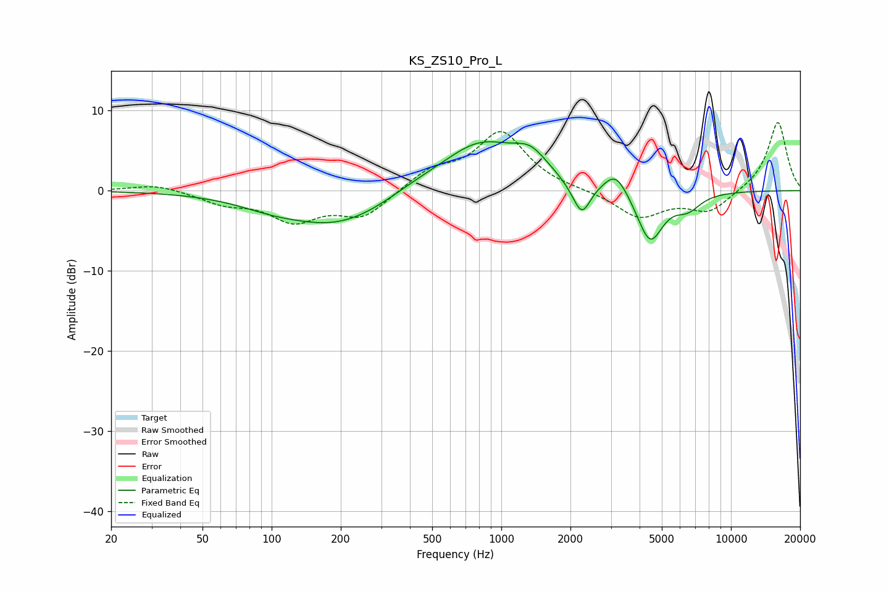

# KS_ZS10_Pro_L
See [usage instructions](https://github.com/jaakkopasanen/AutoEq#usage) for more options and info.

### Parametric EQs
Apply preamp of -6.2 dB when using parametric equalizer.

|   # | Type    |   Fc (Hz) |    Q |   Gain (dB) |
|-----|---------|-----------|------|-------------|
|   1 | Peaking |        98 | 1.01 |        -0.8 |
|   2 | Peaking |       197 | 0.59 |        -4.4 |
|   3 | Peaking |       416 | 1.01 |         0.9 |
|   4 | Peaking |       812 | 0.81 |         6   |
|   5 | Peaking |      1342 | 1.91 |         2.6 |
|   6 | Peaking |      2143 | 2.79 |        -1   |
|   7 | Peaking |      2250 | 3.88 |        -3.3 |
|   8 | Peaking |      3156 | 2.7  |         2.8 |
|   9 | Peaking |      4441 | 2.44 |        -6.5 |
|  10 | Peaking |      6494 | 2.45 |        -1.8 |

### Fixed Band EQs
When using fixed band (also called graphic) equalizer, apply preamp of **-8.6 dB** (if available) and set gains manually with these parameters.

|   # | Type    |   Fc (Hz) |    Q |   Gain (dB) |
|-----|---------|-----------|------|-------------|
|   1 | Peaking |        31 | 1.41 |         0.8 |
|   2 | Peaking |        62 | 1.41 |        -1.4 |
|   3 | Peaking |       125 | 1.41 |        -3.5 |
|   4 | Peaking |       250 | 1.41 |        -3.2 |
|   5 | Peaking |       500 | 1.41 |         2.3 |
|   6 | Peaking |      1000 | 1.41 |         7.2 |
|   7 | Peaking |      2000 | 1.41 |         0   |
|   8 | Peaking |      4000 | 1.41 |        -3.3 |
|   9 | Peaking |      8000 | 1.41 |        -2.6 |
|  10 | Peaking |     16000 | 1.41 |         8.7 |

### Graphs

