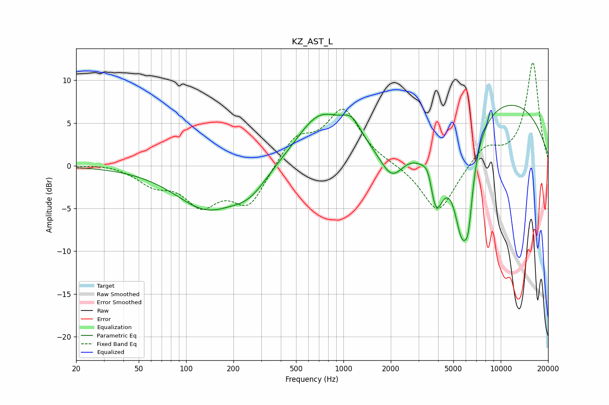

# KZ_AST_L
See [usage instructions](https://github.com/jaakkopasanen/AutoEq#usage) for more options and info.

### Parametric EQs
Apply preamp of -7.2 dB when using parametric equalizer.

|   # | Type    |   Fc (Hz) |    Q |   Gain (dB) |
|-----|---------|-----------|------|-------------|
|   1 | Peaking |       135 | 0.7  |        -4.8 |
|   2 | Peaking |       253 | 1.23 |        -2.3 |
|   3 | Peaking |       708 | 0.91 |         5.8 |
|   4 | Peaking |      1128 | 2.22 |         2.4 |
|   5 | Peaking |      2036 | 1.83 |        -3.7 |
|   6 | Peaking |      3498 | 4.02 |         3.2 |
|   7 | Peaking |      3824 | 2.58 |        -9   |
|   8 | Peaking |      5650 | 2.35 |       -11.8 |
|   9 | Peaking |      6229 | 5.15 |        -5.1 |
|  10 | Peaking |      9429 | 0.27 |         8.1 |

### Fixed Band EQs
When using fixed band (also called graphic) equalizer, apply preamp of **-12.2 dB** (if available) and set gains manually with these parameters.

|   # | Type    |   Fc (Hz) |    Q |   Gain (dB) |
|-----|---------|-----------|------|-------------|
|   1 | Peaking |        31 | 1.41 |         0.3 |
|   2 | Peaking |        62 | 1.41 |        -1.9 |
|   3 | Peaking |       125 | 1.41 |        -4.1 |
|   4 | Peaking |       250 | 1.41 |        -4.5 |
|   5 | Peaking |       500 | 1.41 |         3.2 |
|   6 | Peaking |      1000 | 1.41 |         6.4 |
|   7 | Peaking |      2000 | 1.41 |         0.1 |
|   8 | Peaking |      4000 | 1.41 |        -5.7 |
|   9 | Peaking |      8000 | 1.41 |         2.3 |
|  10 | Peaking |     16000 | 1.41 |        12.1 |

### Graphs

