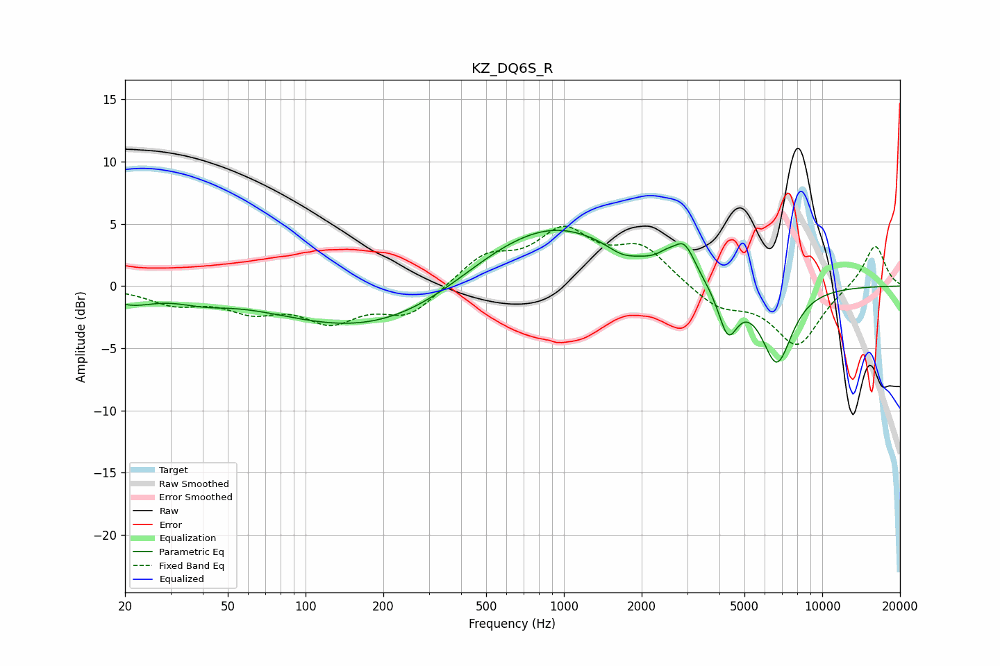

# KZ_DQ6S_R
See [usage instructions](https://github.com/jaakkopasanen/AutoEq#usage) for more options and info.

### Parametric EQs
Apply preamp of -4.6 dB when using parametric equalizer.

|   # | Type    |   Fc (Hz) |    Q |   Gain (dB) |
|-----|---------|-----------|------|-------------|
|   1 | Peaking |        21 | 1.56 |        -1.1 |
|   2 | Peaking |        40 | 1.42 |        -0.6 |
|   3 | Peaking |       179 | 0.4  |        -3.6 |
|   4 | Peaking |       505 | 0.77 |         0.7 |
|   5 | Peaking |       913 | 0.54 |         4.9 |
|   6 | Peaking |      1673 | 2.61 |        -0.6 |
|   7 | Peaking |      2502 | 3.93 |         0.6 |
|   8 | Peaking |      2929 | 3.36 |         2.4 |
|   9 | Peaking |      4315 | 3.68 |        -3.8 |
|  10 | Peaking |      6673 | 2.26 |        -6.2 |

### Fixed Band EQs
When using fixed band (also called graphic) equalizer, apply preamp of **-4.9 dB** (if available) and set gains manually with these parameters.

|   # | Type    |   Fc (Hz) |    Q |   Gain (dB) |
|-----|---------|-----------|------|-------------|
|   1 | Peaking |        31 | 1.41 |        -1.3 |
|   2 | Peaking |        62 | 1.41 |        -1.7 |
|   3 | Peaking |       125 | 1.41 |        -2.5 |
|   4 | Peaking |       250 | 1.41 |        -2.3 |
|   5 | Peaking |       500 | 1.41 |         2.3 |
|   6 | Peaking |      1000 | 1.41 |         4   |
|   7 | Peaking |      2000 | 1.41 |         2.9 |
|   8 | Peaking |      4000 | 1.41 |        -1.7 |
|   9 | Peaking |      8000 | 1.41 |        -4.7 |
|  10 | Peaking |     16000 | 1.41 |         3.4 |

### Graphs

