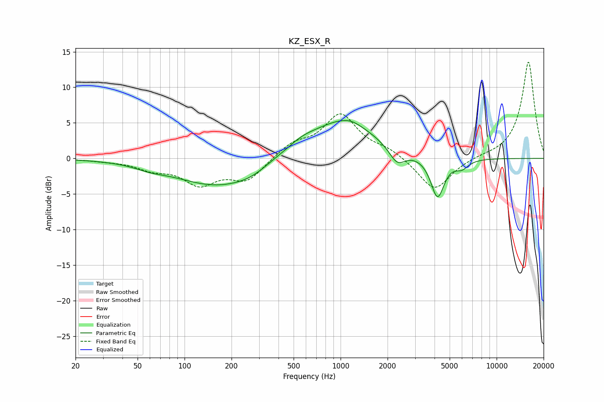

# KZ_ESX_R
See [usage instructions](https://github.com/jaakkopasanen/AutoEq#usage) for more options and info.

### Parametric EQs
Apply preamp of -5.4 dB when using parametric equalizer.

|   # | Type    |   Fc (Hz) |    Q |   Gain (dB) |
|-----|---------|-----------|------|-------------|
|   1 | Peaking |        60 | 1.52 |        -0.5 |
|   2 | Peaking |       171 | 0.5  |        -4   |
|   3 | Peaking |       262 | 1.81 |        -0.3 |
|   4 | Peaking |       371 | 2.15 |         0.2 |
|   5 | Peaking |       554 | 1.3  |         1.4 |
|   6 | Peaking |      1047 | 0.69 |         5.3 |
|   7 | Peaking |      1173 | 3.04 |         0.3 |
|   8 | Peaking |      2304 | 2.74 |        -2.3 |
|   9 | Peaking |      4180 | 3.25 |        -5.7 |
|  10 | Peaking |      5975 | 3.22 |        -1.2 |

### Fixed Band EQs
When using fixed band (also called graphic) equalizer, apply preamp of **-13.6 dB** (if available) and set gains manually with these parameters.

|   # | Type    |   Fc (Hz) |    Q |   Gain (dB) |
|-----|---------|-----------|------|-------------|
|   1 | Peaking |        31 | 1.41 |        -0.2 |
|   2 | Peaking |        62 | 1.41 |        -1.3 |
|   3 | Peaking |       125 | 1.41 |        -3.4 |
|   4 | Peaking |       250 | 1.41 |        -3   |
|   5 | Peaking |       500 | 1.41 |         1.9 |
|   6 | Peaking |      1000 | 1.41 |         6   |
|   7 | Peaking |      2000 | 1.41 |         1.1 |
|   8 | Peaking |      4000 | 1.41 |        -4.7 |
|   9 | Peaking |      8000 | 1.41 |         0.2 |
|  10 | Peaking |     16000 | 1.41 |        13.7 |

### Graphs

