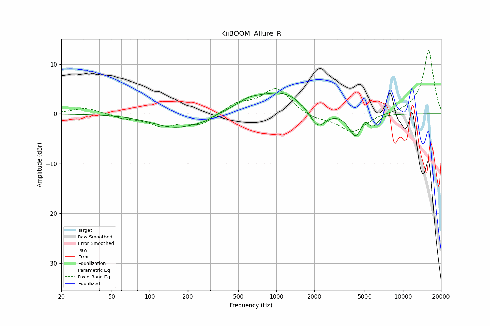

# KiiBOOM_Allure_R
See [usage instructions](https://github.com/jaakkopasanen/AutoEq#usage) for more options and info.

### Parametric EQs
Apply preamp of -4.3 dB when using parametric equalizer.

|   # | Type    |   Fc (Hz) |    Q |   Gain (dB) |
|-----|---------|-----------|------|-------------|
|   1 | Peaking |       163 | 0.77 |        -2.9 |
|   2 | Peaking |       264 | 2.33 |        -0.5 |
|   3 | Peaking |       604 | 1.29 |         1.7 |
|   4 | Peaking |      1127 | 0.76 |         4.2 |
|   5 | Peaking |      1828 | 2.53 |        -0.5 |
|   6 | Peaking |      2148 | 2.34 |        -3.7 |
|   7 | Peaking |      4206 | 2.85 |        -4.6 |
|   8 | Peaking |      5096 | 5.99 |         1   |
|   9 | Peaking |      5420 | 6    |        -0.8 |
|  10 | Peaking |      5956 | 4.35 |        -1.6 |

### Fixed Band EQs
When using fixed band (also called graphic) equalizer, apply preamp of **-12.8 dB** (if available) and set gains manually with these parameters.

|   # | Type    |   Fc (Hz) |    Q |   Gain (dB) |
|-----|---------|-----------|------|-------------|
|   1 | Peaking |        31 | 1.41 |         1.3 |
|   2 | Peaking |        62 | 1.41 |        -0.8 |
|   3 | Peaking |       125 | 1.41 |        -2.3 |
|   4 | Peaking |       250 | 1.41 |        -2.2 |
|   5 | Peaking |       500 | 1.41 |         2   |
|   6 | Peaking |      1000 | 1.41 |         5.1 |
|   7 | Peaking |      2000 | 1.41 |        -1.1 |
|   8 | Peaking |      4000 | 1.41 |        -3.7 |
|   9 | Peaking |      8000 | 1.41 |         0   |
|  10 | Peaking |     16000 | 1.41 |        12.9 |

### Graphs

