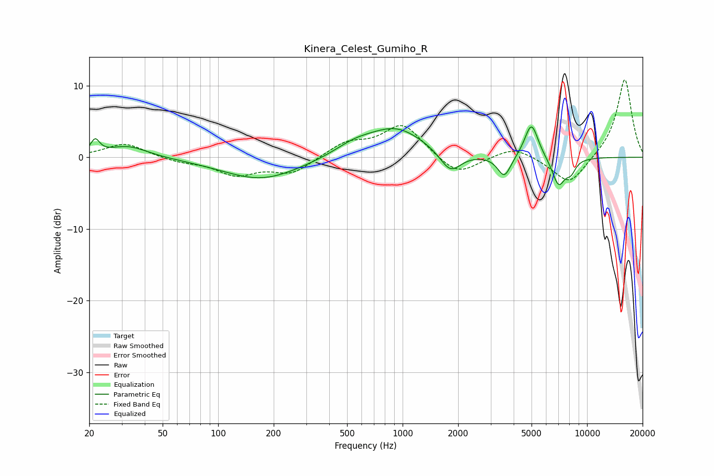

# Kinera_Celest_Gumiho_R
See [usage instructions](https://github.com/jaakkopasanen/AutoEq#usage) for more options and info.

### Parametric EQs
Apply preamp of -4.3 dB when using parametric equalizer.

|   # | Type    |   Fc (Hz) |    Q |   Gain (dB) |
|-----|---------|-----------|------|-------------|
|   1 | Peaking |        22 | 5.98 |         1.9 |
|   2 | Peaking |        32 | 1.3  |         1.6 |
|   3 | Peaking |       172 | 0.67 |        -3.1 |
|   4 | Peaking |       545 | 1.31 |         1.3 |
|   5 | Peaking |       920 | 0.91 |         4   |
|   6 | Peaking |      1816 | 2.48 |        -3   |
|   7 | Peaking |      3562 | 3.9  |        -3   |
|   8 | Peaking |      4994 | 3.74 |         4.9 |
|   9 | Peaking |      7010 | 3.74 |        -4   |
|  10 | Peaking |      8172 | 5.04 |        -1.5 |

### Fixed Band EQs
When using fixed band (also called graphic) equalizer, apply preamp of **-10.9 dB** (if available) and set gains manually with these parameters.

|   # | Type    |   Fc (Hz) |    Q |   Gain (dB) |
|-----|---------|-----------|------|-------------|
|   1 | Peaking |        31 | 1.41 |         2   |
|   2 | Peaking |        62 | 1.41 |        -0.6 |
|   3 | Peaking |       125 | 1.41 |        -2.3 |
|   4 | Peaking |       250 | 1.41 |        -2.2 |
|   5 | Peaking |       500 | 1.41 |         1.9 |
|   6 | Peaking |      1000 | 1.41 |         4.6 |
|   7 | Peaking |      2000 | 1.41 |        -2.7 |
|   8 | Peaking |      4000 | 1.41 |         1.6 |
|   9 | Peaking |      8000 | 1.41 |        -4   |
|  10 | Peaking |     16000 | 1.41 |        11.1 |

### Graphs

