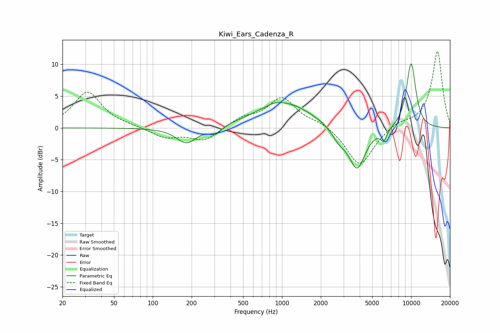

# Kiwi_Ears_Cadenza_R
See [usage instructions](https://github.com/jaakkopasanen/AutoEq#usage) for more options and info.

### Parametric EQs
Apply preamp of -10.2 dB when using parametric equalizer.

|   # | Type    |   Fc (Hz) |    Q |   Gain (dB) |
|-----|---------|-----------|------|-------------|
|   1 | Peaking |       183 | 1.8  |        -2.5 |
|   2 | Peaking |       306 | 3.24 |        -1.2 |
|   3 | Peaking |       894 | 2.4  |         0.3 |
|   4 | Peaking |      1012 | 1.83 |        -0.2 |
|   5 | Peaking |      1042 | 0.68 |         4.1 |
|   6 | Peaking |      2762 | 2.41 |        -1.8 |
|   7 | Peaking |      3820 | 2.2  |        -6.5 |
|   8 | Peaking |      6141 | 5.58 |        -1.8 |
|   9 | Peaking |     10000 | 3.24 |         5.2 |
|  10 | Peaking |     10000 | 3.25 |         5   |

### Fixed Band EQs
When using fixed band (also called graphic) equalizer, apply preamp of **-12.1 dB** (if available) and set gains manually with these parameters.

|   # | Type    |   Fc (Hz) |    Q |   Gain (dB) |
|-----|---------|-----------|------|-------------|
|   1 | Peaking |        31 | 1.41 |         5.7 |
|   2 | Peaking |        62 | 1.41 |         0.2 |
|   3 | Peaking |       125 | 1.41 |        -1.5 |
|   4 | Peaking |       250 | 1.41 |        -2   |
|   5 | Peaking |       500 | 1.41 |         1.4 |
|   6 | Peaking |      1000 | 1.41 |         4.6 |
|   7 | Peaking |      2000 | 1.41 |         0.9 |
|   8 | Peaking |      4000 | 1.41 |        -6.1 |
|   9 | Peaking |      8000 | 1.41 |         0.9 |
|  10 | Peaking |     16000 | 1.41 |        12.1 |

### Graphs

