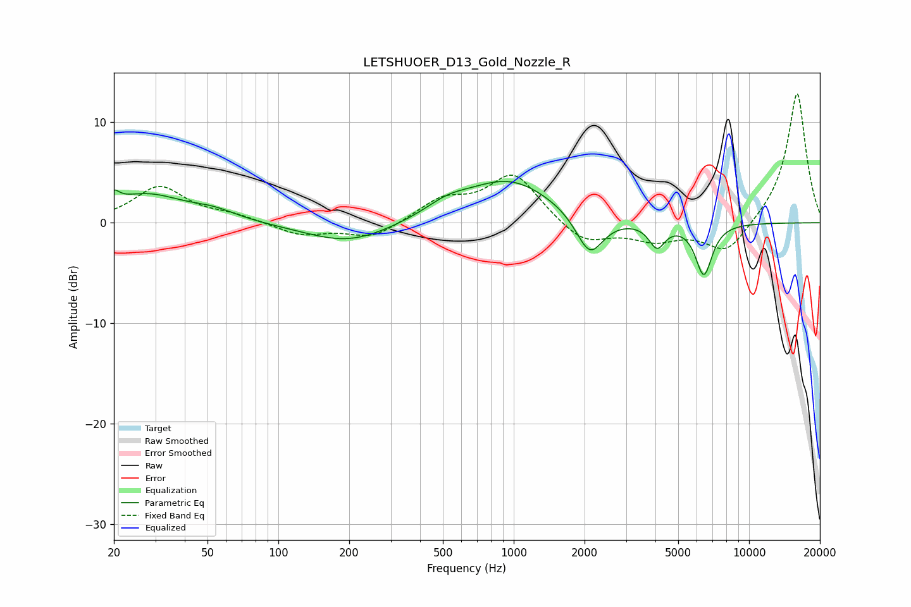

# LETSHUOER_D13_Gold_Nozzle_R
See [usage instructions](https://github.com/jaakkopasanen/AutoEq#usage) for more options and info.

### Parametric EQs
Apply preamp of -4.2 dB when using parametric equalizer.

|   # | Type    |   Fc (Hz) |    Q |   Gain (dB) |
|-----|---------|-----------|------|-------------|
|   1 | Peaking |        20 | 5.99 |         3.1 |
|   2 | Peaking |        20 | 6    |        -1.9 |
|   3 | Peaking |        27 | 0.88 |         2.7 |
|   4 | Peaking |        53 | 1.47 |         0.8 |
|   5 | Peaking |       198 | 0.77 |        -2.1 |
|   6 | Peaking |       520 | 1.51 |         1.1 |
|   7 | Peaking |       956 | 0.74 |         4.2 |
|   8 | Peaking |      2104 | 2.43 |        -4.1 |
|   9 | Peaking |      4065 | 4.12 |        -2.4 |
|  10 | Peaking |      6425 | 3.87 |        -5.1 |

### Fixed Band EQs
When using fixed band (also called graphic) equalizer, apply preamp of **-12.9 dB** (if available) and set gains manually with these parameters.

|   # | Type    |   Fc (Hz) |    Q |   Gain (dB) |
|-----|---------|-----------|------|-------------|
|   1 | Peaking |        31 | 1.41 |         3.5 |
|   2 | Peaking |        62 | 1.41 |         0.7 |
|   3 | Peaking |       125 | 1.41 |        -1.2 |
|   4 | Peaking |       250 | 1.41 |        -1.6 |
|   5 | Peaking |       500 | 1.41 |         2.1 |
|   6 | Peaking |      1000 | 1.41 |         4.8 |
|   7 | Peaking |      2000 | 1.41 |        -2.2 |
|   8 | Peaking |      4000 | 1.41 |        -1.6 |
|   9 | Peaking |      8000 | 1.41 |        -3.1 |
|  10 | Peaking |     16000 | 1.41 |        13.1 |

### Graphs

