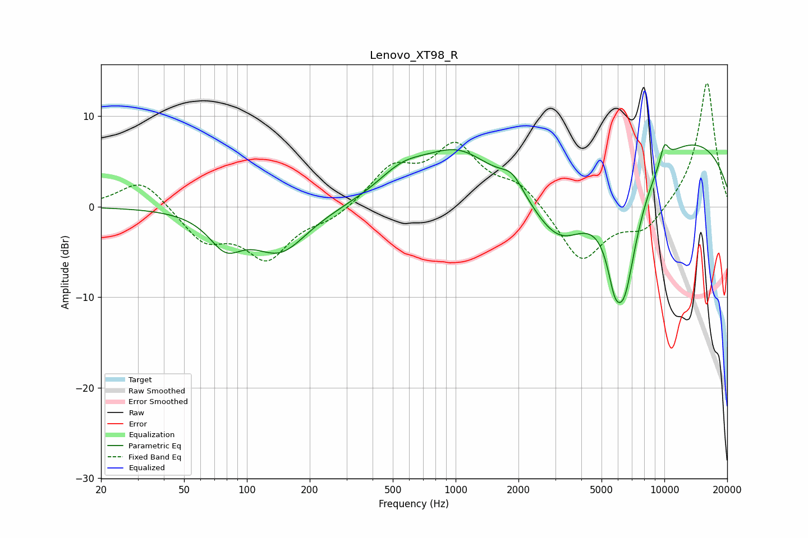

# Lenovo_XT98_R
See [usage instructions](https://github.com/jaakkopasanen/AutoEq#usage) for more options and info.

### Parametric EQs
Apply preamp of -6.9 dB when using parametric equalizer.

|   # | Type    |   Fc (Hz) |    Q |   Gain (dB) |
|-----|---------|-----------|------|-------------|
|   1 | Peaking |        79 | 1.78 |        -3.5 |
|   2 | Peaking |       144 | 1.07 |        -4.8 |
|   3 | Peaking |       553 | 1.15 |         2.6 |
|   4 | Peaking |      1021 | 0.83 |         5   |
|   5 | Peaking |      1869 | 2.54 |         2   |
|   6 | Peaking |      3152 | 0.86 |        -8.8 |
|   7 | Peaking |      5770 | 4.16 |        -3.7 |
|   8 | Peaking |      6426 | 1.83 |       -13.9 |
|   9 | Peaking |      8858 | 0.2  |         8.7 |
|  10 | Peaking |     10000 | 5.91 |         2.1 |

### Fixed Band EQs
When using fixed band (also called graphic) equalizer, apply preamp of **-13.7 dB** (if available) and set gains manually with these parameters.

|   # | Type    |   Fc (Hz) |    Q |   Gain (dB) |
|-----|---------|-----------|------|-------------|
|   1 | Peaking |        31 | 1.41 |         3.2 |
|   2 | Peaking |        62 | 1.41 |        -3.6 |
|   3 | Peaking |       125 | 1.41 |        -5.4 |
|   4 | Peaking |       250 | 1.41 |        -1.3 |
|   5 | Peaking |       500 | 1.41 |         4   |
|   6 | Peaking |      1000 | 1.41 |         6.2 |
|   7 | Peaking |      2000 | 1.41 |         2.4 |
|   8 | Peaking |      4000 | 1.41 |        -6.2 |
|   9 | Peaking |      8000 | 1.41 |        -2.7 |
|  10 | Peaking |     16000 | 1.41 |        13.9 |

### Graphs

