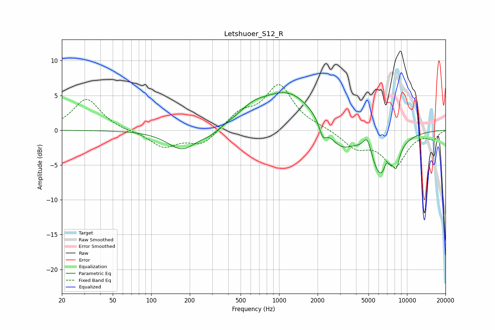

# Letshuoer_S12_R
See [usage instructions](https://github.com/jaakkopasanen/AutoEq#usage) for more options and info.

### Parametric EQs
Apply preamp of -5.5 dB when using parametric equalizer.

|   # | Type    |   Fc (Hz) |    Q |   Gain (dB) |
|-----|---------|-----------|------|-------------|
|   1 | Peaking |       175 | 1.22 |        -2.9 |
|   2 | Peaking |       289 | 2.08 |        -0.7 |
|   3 | Peaking |       619 | 1.38 |         1.4 |
|   4 | Peaking |      1174 | 0.64 |         5.5 |
|   5 | Peaking |      2196 | 4.97 |        -2   |
|   6 | Peaking |      2992 | 1.43 |        -3.1 |
|   7 | Peaking |      4902 | 4.11 |         2.7 |
|   8 | Peaking |      6307 | 1.5  |        -7   |
|   9 | Peaking |      6901 | 6    |         1.6 |
|  10 | Peaking |      8255 | 5.39 |        -2.3 |

### Fixed Band EQs
When using fixed band (also called graphic) equalizer, apply preamp of **-6.7 dB** (if available) and set gains manually with these parameters.

|   # | Type    |   Fc (Hz) |    Q |   Gain (dB) |
|-----|---------|-----------|------|-------------|
|   1 | Peaking |        31 | 1.41 |         4.5 |
|   2 | Peaking |        62 | 1.41 |        -0.1 |
|   3 | Peaking |       125 | 1.41 |        -2.3 |
|   4 | Peaking |       250 | 1.41 |        -2.1 |
|   5 | Peaking |       500 | 1.41 |         2.3 |
|   6 | Peaking |      1000 | 1.41 |         6.3 |
|   7 | Peaking |      2000 | 1.41 |         0.3 |
|   8 | Peaking |      4000 | 1.41 |        -2.4 |
|   9 | Peaking |      8000 | 1.41 |        -5   |
|  10 | Peaking |     16000 | 1.41 |        -1.1 |

### Graphs

